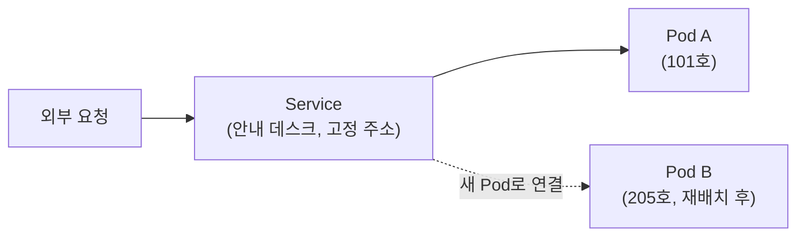

새벽 2시, 알람이 울립니다. "결제 서비스 Pod가 CrashLoopBackOff 상태입니다." 같은 장애, 같은 정보를 받았는데도 사람마다 다음 30분을 완전히 다르게 씁니다. 그 차이가 바로 "말만 앞서는 사람"과 "실제로 해결하는 사람"을 가른다고 생각합니다.
<!--more-->

이력서의 화려한 스펙이나 면접 답변으로는 이 차이가 잘 안 보입니다. 대신 **문제를 다루는 행동 패턴**에서 선명하게 드러납니다. 쿠버네티스 장애 대응이라는 구체적인 장면을 빌려 네 가지 패턴을 풀어보겠습니다.

## ① '현상'과 '원인'을 분리하여 질문한다

같은 알람을 받은 두 사람을 비교해 보겠습니다.



> "Pod가 CrashLoopBackOff예요. 일단 재시작하겠습니다."

```bash
kubectl delete pod payment-service-7d8f9c-x2k4j
```

새 Pod가 뜨고, 5분 후 또 같은 상태가 됩니다. 같은 조치를 반복하다가 결국 누군가에게 에스컬레이션합니다.


> "재시작 전에 죽은 이유부터 보죠. 방금 죽기 직전 로그를 먼저 확인하겠습니다."

```bash
# 재시작 전 컨테이너가 왜 죽었는지부터 본다
kubectl logs payment-service-7d8f9c-x2k4j --previous
kubectl describe pod payment-service-7d8f9c-x2k4j | grep -A5 "Last State"
```

```text
Last State:  Terminated
  Reason:    OOMKilled
  Exit Code: 137
```

> "OOMKilled네요. 메모리 limit이 모자른 게 아니라, 최근 배포된 캐싱 모듈에서 메모리 누수가 의심됩니다. 배포 직전 트래픽 그래프 좀 같이 봐주실 수 있나요?"



재시작은 "현상"을 잠깐 가릴 뿐 "원인"을 묻지 않습니다. `CrashLoopBackOff`는 결과일 뿐이고, `OOMKilled`인지 `Error`인지 `Liveness probe 실패`인지에 따라 손을 대야 할 곳이 완전히 다릅니다. 실무 능력자는 **해결책을 던지기 전에 질문의 정확도**부터 다릅니다. "재시작할까요?"가 아니라 "직전 상태가 뭐였죠?"를 먼저 묻습니다.


실전 팁: `kubectl logs --previous`와 `kubectl describe pod`의 `Last State` 섹션은 죽기 직전 컨테이너의 마지막 진술서입니다. 재시작 명령보다 먼저 눌러야 할 버튼입니다.


## ② 복잡한 개념을 초등학생도 이해하게 설명한다

비개발자인 팀장이 묻습니다. "그래서 Pod가 재시작되면 왜 주소(IP)가 바뀌어요? 그게 왜 문제예요?"

전문 용어로 답하면 이렇게 됩니다: *"Pod는 휘발성 리소스라 재스케줄링 시 새로운 IP를 할당받기 때문에, 클라이언트가 고정 IP로 직접 접근하면 Connection Refused가 발생합니다."* — 틀린 말은 아니지만 팀장은 알아듣지 못합니다.

메타인지가 높은 실무자는 비유로 풉니다.

> "Pod 하나하나는 호텔 객실 같은 거예요. 청소나 보수 때문에 손님이 옆방으로 옮겨질 수 있잖아요. 그러면 그 객실 번호로 전화를 걸던 사람은 연결이 안 되겠죠. 그래서 우리는 'Service'라는 **호텔 안내 데스크**를 하나 둡니다. 외부에서는 항상 안내 데스크 번호로만 전화하고, 안내 데스크가 그 손님이 지금 몇 호실에 있는지 추적해서 연결해 줍니다. Pod 번지수(IP)가 바뀌어도 안내 데스크(Service) 번호는 절대 안 바뀌니까 문제가 없는 거예요."



전문 용어를 줄줄 읊는다고 깊이가 있는 게 아닙니다. 오히려 자기가 정확히 뭘 알고 있는지 아는 사람만이, 상대의 눈높이에 맞춰 비유를 정확하게 골라낼 수 있습니다.

## ③ 예외 상황(Edge Case)과 리스크를 먼저 계산한다

신규 버전 배포를 앞두고 두 사람의 머릿속이 다릅니다.

- **해피패스만 보는 사람**: "이미지 빌드됐고, 매니페스트 적용하면 끝이죠." → `kubectl apply -f deployment.yaml` 실행 후 자리를 뜹니다.
- **리스크를 먼저 계산하는 사람**: 배포 적용 *전에* 이미 답을 준비해 둡니다.
  - "새 버전이 실패하면 되돌릴 방법은?" → `kubectl rollout undo deployment/payment-service`가 즉시 먹히도록 `revisionHistoryLimit`을 확인해 둔다.
  - "배포 도중 트래픽이 한쪽으로만 몰리면?" → `readinessProbe`로 준비 안 된 Pod에 트래픽이 가지 않게 막아둔다.
  - "노드 점검 중에 가용 Pod가 0개가 되면?" → `PodDisruptionBudget`으로 최소 가용 개수를 보장해 둔다.

```yaml
# 배포 전에 이미 깔아둔 안전망
apiVersion: policy/v1
kind: PodDisruptionBudget
metadata:
  name: payment-service-pdb
spec:
  minAvailable: 2
  selector:
    matchLabels:
      app: payment-service
```

해피패스만 그리는 사람은 계획이 "성공했을 때"의 그림만 그립니다. 리스크를 계산하는 사람은 "실패했을 때 누르는 비상벨"을 계획 단계에서 이미 설치해 둡니다. 사고가 터졌을 때 비로소 `rollout undo`를 검색하는 사람과, 사고가 나기 전에 이미 되돌릴 수 있는 상태를 만들어 둔 사람의 차이입니다.

## ④ 지식의 '족보(Context)'를 알고 있다

"이 클러스터는 왜 `PodSecurityPolicy` 대신 `Pod Security Admission`을 쓰나요?"라는 질문에 두 가지 답이 가능합니다.

- "예전 가이드에 있던 대로 그냥 복사해서 썼습니다."
- "PSP는 쿠버네티스 1.25에서 완전히 제거됐습니다. 복잡한 어드미션 규칙 때문에 유지보수가 어려웠던 게 폐기 이유였고, 후속으로 훨씬 단순한 `baseline`/`restricted` 레벨을 네임스페이스 라벨로 지정하는 PSA가 들어왔습니다. 더 세밀한 정책이 필요하면 그 위에 Kyverno나 OPA Gatekeeper를 얹는 게 지금 권장되는 조합입니다."

전자는 "구글링해서 복사·붙여넣기"한 결과물이고, 후자는 그 기술이 **왜 지금의 모습으로 존재하는지 족보**를 꿰고 있는 답입니다. 이런 사람은 새로운 버전이 나왔을 때 "이번에 또 뭐가 deprecated됐지?"를 스스로 점검하고, 오픈소스를 도입할 때 "이 프로젝트가 과거 어떤 CVE를 겪었고 지금 메인테이너 활동이 활발한지"까지 확인합니다. 맥락을 알아야 다음에 같은 실수를 피할 수 있기 때문입니다.


족보를 모르고 가이드만 따라 하면, 가이드를 만든 시점의 가정(예: "PSP가 아직 존재하던 시절")이 깨졌을 때 왜 안 되는지조차 모릅니다.


## 이 사이트가 이 패턴을 어떻게 반영했는가

사실 이 네 가지 패턴은 이 지식베이스의 글쓰기 규칙과 그대로 맞물립니다. [Docs](/docs)의 모든 Hands-on 문서는 의도적으로 "현상 → 의심되는 원인(가설) → 확인할 로그/명령어 → 조치" 순서로 적혀 있습니다(①). 개념 설명에는 가능한 한 비유와 다이어그램을 곁들였습니다(②). 트러블슈팅 시나리오에는 Happy path만이 아니라 실패 상황을 함께 다뤘습니다(③). 그리고 보안·구성관리처럼 카테고리를 가를 때도 "왜 이 경계로 나눴는가"라는 근거를 남겨두려 했습니다(④).

결국 실무 능력은 화려한 답이 아니라, **무엇을 묻고 무엇을 먼저 확인하고 무엇을 미리 준비해 두는가**에서 드러납니다.
