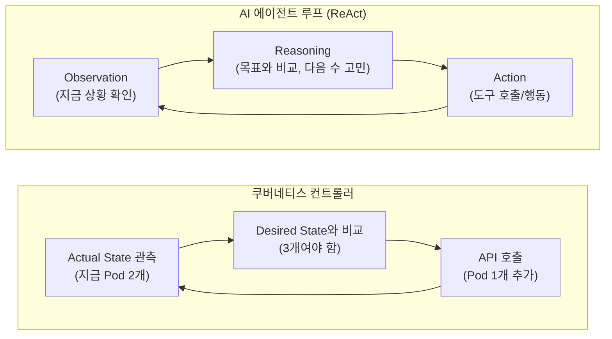

내비게이션 앱을 켜고 운전하다가 갈림길에서 엉뚱한 차선으로 빠졌다고 해봅시다. 내비게이션은 화내지 않습니다. 그냥 1초 만에 "다시 계산 중..."이라는 문구를 띄우고 새 경로를 보여줍니다. 목적지(목표)는 그대로인데, 현재 위치(상태)가 바뀌었으니 거기에 맞춰 다음 행동만 다시 정하는 거죠. 이 단순한 동작 하나가, 쿠버네티스 컨트롤러와 요즘 화제인 AI 에이전트 루프를 관통하는 똑같은 원리입니다.
<!--more-->

## 같은 춤을 추는 두 시스템

내비게이션이 하는 일을 3단계로 쪼개 보면 이렇습니다.

1. **지금 어디 있지?** (현재 위치를 GPS로 관측)
2. **목적지랑 비교하면 경로에서 벗어났나?** (차이 계산)
3. **벗어났으면 새 경로를 안내한다** (행동)

그리고 이 셋을 도착할 때까지 영원히 반복합니다. 이게 바로 **제어 이론(Control Theory)**의 핵심 구조이고, 쿠버네티스와 AI 에이전트는 이 구조를 각각 다른 영역에 그대로 적용한 것입니다.



내비게이션의 "관측 → 비교 → 재계산" 루프를, 쿠버네티스는 **인프라 상태**에 적용했고, AI 에이전트는 **불확실한 과업(Task)**에 적용했습니다. 풀어야 할 문제가 다를 뿐, 루프의 골격은 동일합니다.

## 쿠버네티스가 먼저 풀어낸 두 가지 어려운 문제

쿠버네티스는 10년 가까이 이 루프를 인프라에서 검증해 왔습니다. 그 과정에서 풀어낸 두 가지 문제는 AI 에이전트가 지금 똑같이 마주하고 있는 숙제입니다.

### 1. 멱등성(Idempotency) — "같은 명령을 100번 내려도 결과가 같아야 한다"

내비게이션을 같은 위치에서 "다시 계산하기"를 100번 눌러도 매번 같은 경로가 나와야 신뢰할 수 있습니다. 만약 누를 때마다 다른 경로가 튀어나온다면 그 내비게이션은 쓸 수 없겠죠.



```bash
# 같은 매니페스트를 몇 번을 적용해도 결과는 동일하다
kubectl apply -f deployment.yaml   # replicas: 3, 지금 3개 → 아무 일도 안 함
kubectl apply -f deployment.yaml   # 또 적용 → 여전히 아무 일도 안 함
kubectl apply -f deployment.yaml   # 100번째 적용 → 여전히 Pod는 3개
```
컨트롤러는 "지금 상태가 이미 desired state와 같다"는 걸 확인하면 그냥 아무것도 하지 않습니다. 같은 동작을 반복해도 시스템이 오염되지 않는 것 — 이게 멱등성입니다.


```text
에이전트: "결제 API를 호출해서 주문을 완료시켜라"
1차 호출 → 타임아웃 (성공했는지 실패했는지 불명확)
에이전트 판단: "응답을 못 받았으니 재시도하자"
2차 호출 → 만약 1차가 사실 성공했었다면, 중복 결제가 발생한다!
```
AI 에이전트 루프에서 재시도(Retry)는 필수입니다. 그런데 재시도했을 때 시스템이 오염되지 않으려면(중복 결제, 중복 메일 발송 방지) **Idempotency Key** 같은 장치로 "같은 요청은 결과가 같아야 한다"는 쿠버네티스식 원칙을 그대로 가져와야 합니다.



### 2. 상태 추상화 — "거대한 현실을 다루기 쉬운 단위로 쪼갠다"

쿠버네티스는 클러스터의 수많은 노드, 파드, 네트워크 정보를 통째로 들고 비교하지 않습니다. `etcd`에 정리된 객체 단위(Pod, Deployment, Service...)로 추상화해서 루프가 "비교하기 쉬운 모양"으로 만들어 둡니다.

AI 에이전트도 똑같은 고민을 합니다. LLM에게 작업 전체 history를 매번 통째로 던지면 비싸고 느리고 헷갈립니다. 그래서 에이전트 프레임워크들은 지금까지의 진행 상황을 **체크포인트(Checkpoint)**나 압축된 상태 단위로 정리해서, 매 루프마다 "지금까지 뭘 했고 다음에 뭘 해야 하는지"를 가볍게 비교할 수 있게 만듭니다. 내비게이션이 "지금 위치"만 알면 되지 출발부터 지금까지의 모든 GPS 좌표를 다 들고 있을 필요가 없는 것과 같습니다.

## 왜 지금에서야 "루프 엔지니어링"이 핫해졌나

쿠버네티스가 다루는 목표는 아주 구체적입니다. *"Pod가 정확히 3개여야 한다"* — 숫자로 딱 떨어지는 정량적 목표입니다. 반면 AI 에이전트가 받는 목표는 *"이 고객 문의를 해결하라"*, *"이 버그를 고쳐라"*처럼 모호하고 추상적입니다.

> 친구에게 "삼겹살집 가서 2번 테이블로 가 있어"라고 부탁하는 것과, "아무데나 맛있는 데서 저녁 해결하고 와"라고 부탁하는 것의 차이를 생각해 보세요. 전자는 목적지가 명확해서 길만 안내하면 끝입니다(쿠버네티스). 후자는 친구가 스스로 "맛있다"의 기준을 판단하고, 가게를 고르고, 줄이 길면 다른 곳으로 바꾸는 **추론**까지 해야 합니다(AI 에이전트).

그래서 AI 에이전트의 루프 엔지니어링은 결국 이런 질문으로 좁혀집니다: *"LLM의 모호하고 가끔 헛소리(환각)를 하는 추론 결과를, 쿠버네티스 컨트롤러처럼 안정적이고 예측 가능하게(Deterministic) 만들 수 있을까?"* 인프라의 자동화를 위해 검증된 루프 철학을, 훨씬 불확실한 영역인 지능의 자동화에 이식하려는 시도인 셈입니다.


같은 이유로 AI 에이전트 프레임워크의 코드를 들여다보면 쿠버네티스 컨트롤러의 그림자가 자주 보입니다. 둘 다 "관측 → 비교 → 행동 → 반복"이라는 같은 문법을 쓰고 있기 때문입니다.


## 의사코드로 나란히 놓고 보면

```python
# 쿠버네티스 컨트롤러의 reconcile loop (단순화)
while True:
    desired = get_desired_state()      # 매니페스트에 선언된 목표
    actual  = observe_actual_state()   # 클러스터의 현재 상태
    diff    = compare(desired, actual)
    if diff:
        apply_action(diff)             # API 호출로 차이를 메운다
    sleep(interval)
```

```python
# AI 에이전트의 ReAct 루프 (단순화)
while not goal_achieved():
    observation = observe_environment()        # 지금 상황 확인
    thought      = reason(goal, observation)    # 목표와 비교해 다음 수 고민
    if thought.requires_action:
        action_result = act(thought.action)     # 도구 호출/실제 행동
```

두 코드의 골격이 거의 겹칩니다. 차이는 `compare()`가 정확한 숫자 비교냐, LLM의 추론이냐일 뿐입니다.

## 정리

AI 에이전트가 쿠버네티스를 "베껴 썼다"기보다는, **신뢰할 수 없는 환경에서 신뢰할 수 있는 결과를 얻는 유일하게 검증된 방법이 '루프 + 상태 조정'이라는 것을, 소프트웨어 공학이 다시 한번 같은 결론으로 수렴**한 것이라고 보는 게 더 정확합니다.

이미 [기반 모델(Foundation)](/docs/foundation/)에서 다룬 선언적 API와 reconciliation 패러다임이, 이제는 인프라를 넘어 AI 에이전트의 뇌를 관리하는 핵심 문법으로 확장되고 있습니다. 쿠버네티스의 컨트롤러 패턴을 직접 코드로 다뤄보고 싶다면 [확장성 & 자동화](/docs/extensibility-automation/) 카테고리의 Operator 패턴 실습이 좋은 다음 걸음이 될 것입니다.
