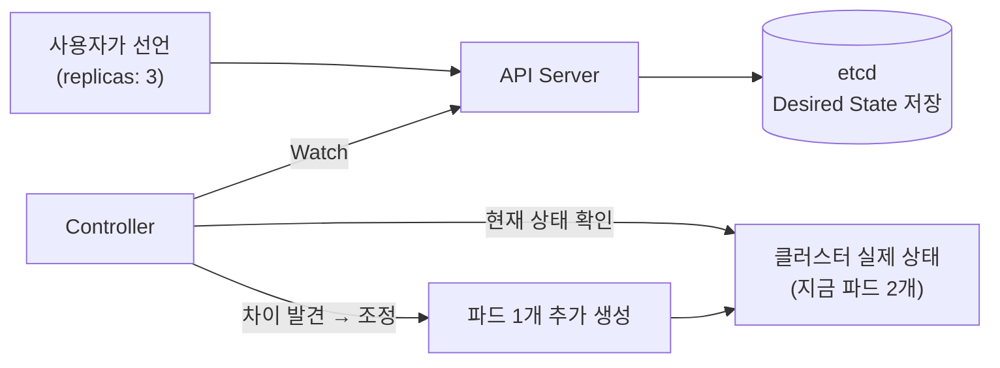

"쿠버네티스는 Stateless한 플랫폼이다"라는 말을 들어본 적 있을 겁니다. 그런데 막상 들여다보면 쿠버네티스는 클러스터의 모든 상태를 한순간도 놓치지 않고 데이터베이스에 기록하고, 끊임없이 감시하고, 끊임없이 비교하는 시스템입니다. 모순처럼 들리지 않나요?
<!--more-->

결론부터 말하면 모순이 아닙니다. **"애플리케이션" 관점과 "쿠버네티스 시스템" 관점을 구분해서 봐야** 풀리는 질문입니다.


**애플리케이션(파드)은 Stateless하게**, **쿠버네티스 제어 평면(Control Plane)은 극도로 Stateful하게** — 이 두 문장은 서로 다른 층(layer)을 가리키고 있어서 동시에 참입니다.


## 비유로 먼저 감을 잡아보기: 콜센터

고객센터에 전화를 건다고 생각해 봅시다. 받는 상담원은 매번 다른 사람일 수 있습니다. 어제 통화한 상담원이 오늘 휴가일 수도, 아예 퇴사했을 수도 있죠. 그런데도 고객은 "저번에 말씀드린 그 문제요"라고만 해도 대화가 이어집니다. 왜일까요?

상담원 개인이 고객의 사연을 기억하고 있는 게 아니라, **CRM 시스템에 고객의 이력이 전부 저장**되어 있고 상담원은 그걸 조회만 하기 때문입니다. 상담원(사람)은 언제든 교체 가능한 "Stateless"한 존재지만, CRM(시스템)은 모든 이력을 한 글자도 잃지 않고 보관하는 "Stateful"한 존재입니다.

쿠버네티스의 파드와 control plane의 관계가 정확히 이 구조입니다.

## 1. 애플리케이션은 Stateless — 왜 그래야 하는가

쿠버네티스 위에서 도는 컨테이너(파드)는 **언제 죽고 언제 다시 떠도 서비스에 지장이 없도록** 설계하는 것이 원칙입니다. 파드는 다음과 같은 이유로 수시로 사라지고 다시 만들어집니다.

- 배포 중 새 버전으로 교체될 때 (롤링 업데이트)
- 노드 장애로 다른 노드로 옮겨갈 때
- 오토스케일러가 트래픽에 맞춰 개수를 늘리거나 줄일 때
- 단순히 메모리를 너무 많이 써서 OOMKilled로 재시작될 때

이때 파드 **안**에 중요한 데이터를 들고 있었다면 그 데이터는 파드가 사라지는 순간 함께 증발합니다.



```yaml
# 파드 로컬 디스크에 업로드 파일을 저장 — 파드가 재시작되면 파일이 사라진다
apiVersion: v1
kind: Pod
metadata:
  name: upload-service
spec:
  containers:
    - name: app
      image: my-upload-app:1.0
      volumeMounts:
        - name: local-storage
          mountPath: /data/uploads
  volumes:
    - name: local-storage
      emptyDir: {} # 파드와 생명주기를 같이 하는 임시 저장소
```
이 구성에서 사용자가 업로드한 파일은 `emptyDir`에 저장됩니다. `emptyDir`은 파드가 삭제되는 순간 함께 삭제되는 휘발성 볼륨이라, 배포 한 번만 해도 사용자 파일이 전부 사라집니다.


```yaml
# 상태는 파드 바깥(외부 스토리지/DB)으로 분리한다
apiVersion: apps/v1
kind: Deployment
metadata:
  name: upload-service
spec:
  replicas: 3
  template:
    spec:
      containers:
        - name: app
          image: my-upload-app:1.0
          env:
            - name: STORAGE_BACKEND
              value: "s3://my-bucket/uploads" # 상태는 S3(또는 PVC)로
            - name: SESSION_STORE
              value: "redis://redis-svc:6379" # 세션도 외부 Redis로
```
파드가 어떤 이유로든 사라지고 다시 뜨더라도, 실제 데이터는 S3나 Redis처럼 파드 생명주기와 무관한 곳에 남아 있습니다. 그래서 파드 3개 중 1개가 갑자기 죽어도 사용자는 아무것도 느끼지 못합니다.



이 원칙을 지키면 얻는 것은 명확합니다: 파드를 **아무 때나, 아무 노드에서나, 아무 개수로나** 다룰 수 있는 자유입니다. 이게 바로 우리가 "쿠버네티스 애플리케이션은 Stateless해야 한다"고 말할 때의 의미입니다.

(완전히 상태를 가질 수밖에 없는 데이터베이스 같은 워크로드는 StatefulSet으로 별도 취급합니다. 이건 [워크로드 & 스케줄링](/docs/workloads-scheduling/) 카테고리에서 다룹니다.)

## 2. 쿠버네티스 시스템은 극도로 Stateful — Continuous State

이제 시선을 애플리케이션에서 **쿠버네티스 자신**으로 옮겨봅시다. 누가 "지금 클러스터에 파드가 몇 개 떠 있어야 하는지", "어떤 노드에 뭐가 배치되어 있는지", "어떤 Service가 어떤 파드로 트래픽을 흘려야 하는지"를 기억하고 있을까요?

쿠버네티스 자신입니다. 그리고 이 기억은 한순간도 끊기면 안 됩니다.

### 자동 온도조절기처럼 동작한다

집에 있는 자동 온도조절기(thermostat)를 떠올려 보세요. 목표 온도를 24도로 맞춰두면, 온도조절기는:

1. 지금 실내 온도를 계속 측정한다 (Actual State 관찰)
2. 목표 온도 24도와 비교한다 (Desired State와 대조)
3. 차이가 있으면 난방/냉방을 켜거나 끈다 (조정, Reconcile)
4. 1번으로 돌아가 무한히 반복한다

쿠버네티스의 컨트롤러도 똑같습니다. "Deployment에 replicas: 3이라고 써놨다"는 게 desired state이고, "지금 실제로 떠 있는 파드 개수"가 actual state입니다. 컨트롤러는 이 둘을 끊임없이 비교하면서 차이가 생기면 즉시 메꿉니다.



### etcd: 클러스터 전체의 기억을 담는 단 하나의 장부

이 모든 desired/actual state는 결국 **etcd**라는 분산 키-값 저장소에 기록됩니다. 클러스터에 노드가 몇 대 있는지, 파드가 어디 떠 있는지, Secret과 ConfigMap 내용이 무엇인지, RBAC 권한이 어떻게 설정돼 있는지 — 이 모든 게 etcd 안에 있습니다.

만약 노드 하나가 갑자기 꺼진다면, 쿠버네티스는 어떻게 "그 노드 위에 떠 있던 파드 5개를 다른 노드에서 다시 살려야 한다"는 걸 알 수 있을까요? etcd에 "그 5개 파드가 desired state로 존재해야 한다"는 기록이 남아있기 때문입니다. 시스템이 끊임없이 그 기록을 들고 비교했기 때문에 장애가 나도 복구할 수 있는 것입니다.


그래서 실무에서는 **etcd 백업이 곧 클러스터 전체의 생명줄**입니다. etcd 데이터를 잃으면 "지금 무엇이 떠 있어야 하는가"에 대한 기억 자체가 사라지므로, 클러스터를 다시 살려도 무엇을 복구해야 할지 알 수 없습니다.


## 두 층을 표로 정리하면

| | 애플리케이션 (파드) | 쿠버네티스 제어 평면 |
| --- | --- | --- |
| 권장되는 성질 | Stateless | (의도적으로) 매우 Stateful |
| 상태를 어디 두는가 | 파드 바깥 (S3, RDS, Redis, PV 등) | etcd (분산 저장소) |
| 죽었을 때 | 다시 띄우면 그만 — 데이터 손실 없음 | 백업이 없으면 클러스터 전체가 "기억상실" |
| 비유 | 콜센터 상담원 | CRM 시스템 / 온도조절기 |
| 목적 | 자유롭게 늘리고 줄이고 교체하기 위해 | 장애가 나도 원래 상태로 스스로 복구하기 위해 |

## 그래서 이걸 알면 뭐가 달라지는가

이 둘을 구분하지 못하면 실무에서 흔히 이런 실수를 합니다.

- 파드 안에 캐시나 업로드 파일을 저장해놓고, 배포할 때마다 데이터가 날아가는 이유를 못 찾는다
- etcd 백업 전략 없이 운영하다가, control plane 노드 장애 한 번에 클러스터 전체 상태를 잃는다
- "쿠버네티스는 알아서 복구해주는 시스템"이라고만 믿고, 그 복구가 사실은 **끊임없이 desired/actual state를 비교하는 reconciliation loop** 덕분이라는 걸 모른 채 트러블슈팅에서 길을 잃는다

정리하면: **애플리케이션을 Stateless하게 짤 수 있는 자유는, 그 밑을 받치고 있는 쿠버네티스 시스템이 클러스터의 모든 상태를 한순간도 놓치지 않고 Stateful하게 기억하고 있기 때문에 가능한 것**입니다. 이 reconciliation loop의 구조를 더 깊이 보고 싶다면 [Foundation 카테고리](/docs/foundation/)에서 control plane/data plane 구성과 선언적 API 모델을 다룹니다.
