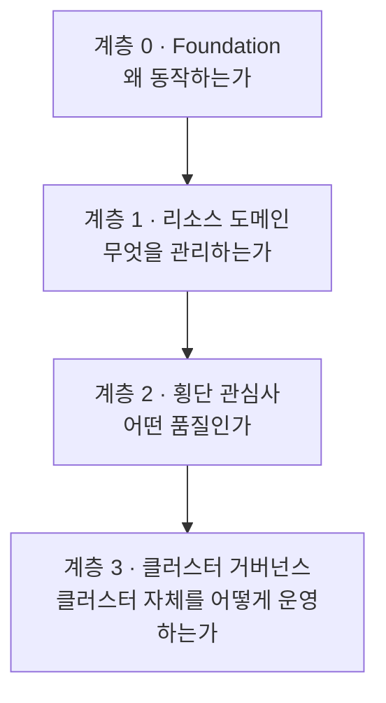

## MECE로 자른 쿠버네티스

"워크로드, 네트워킹, 보안, 관측성…"을 한 평면에 나열하면 상호배타성이 깨집니다. 보안은 네트워킹에도, 스토리지에도, 워크로드에도 걸치기 때문입니다. 이 지식베이스는 **분류 축을 분리**합니다.

- **명사 축** — 무엇을 관리하는가 (리소스 종류, 상호배타적)
- **품질 축** — 어떤 질문에 답하는가 (안전한가/보이는가/견디는가, 횡단 관심사)

## 계층 0 — 기반 모델


  


## 계층 1 — 리소스 도메인 (명사 축)


  
  
  
  


## 계층 2 — 횡단 관심사 (품질 축)


  
  
  
  


## 계층 3 — 클러스터 라이프사이클 & 거버넌스


  
  
  
  

