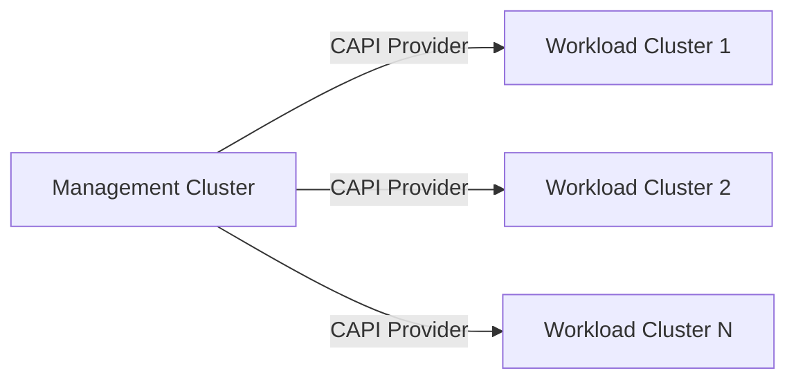
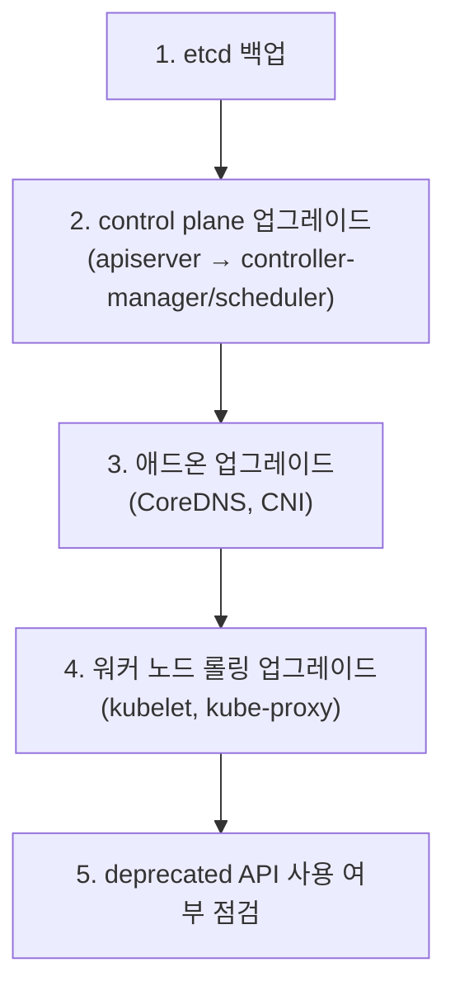

## 왜 알아야 하는가

워크로드 매니페스트를 잘 짜는 것과 클러스터를 안전하게 띄우고 유지하는 것은 완전히 다른 역량이다. 장애의 상당수는 애플리케이션이 아니라 "control plane 업그레이드 중 API 호환성이 깨졌다", "노드풀이 모자라 스케줄링이 멈췄다" 같은 라이프사이클 문제에서 발생한다. 이 영역을 모르면 사고 발생 시 원인을 워크로드 레벨에서만 찾다가 시간을 허비하게 된다.

## 부트스트랩 방식 비교

클러스터를 처음 만드는 방법은 "누가 control plane을 관리하는가"로 갈린다.

| 방식 | control plane 책임 | 장점 | 단점 | 적합한 상황 |
| --- | --- | --- | --- | --- |
| kubeadm | 사용자(직접 운영) | 모든 컴포넌트에 대한 완전한 통제권 | 운영 부담 전부를 직접 진다 (etcd 백업, 인증서 회전 등) | on-prem, 학습/실험, 특수 컴플라이언스 요구 |
| managed (EKS/GKE/AKS) | 클라우드 벤더 | control plane SLA, 자동 패치 | 벤더 종속, 일부 API/플래그 제한 | 대부분의 프로덕션 환경 |
| Cluster API (CAPI) | 선언적으로 클러스터 자체를 관리 | "클러스터를 만드는 것"도 Kubernetes API로 선언적 관리 | 초기 러닝커브, 별도의 management cluster 필요 | 멀티클러스터를 대량으로 찍어내야 하는 플랫폼 팀 |

선택 기준은 단순하다: **벤더 관리형을 쓸 수 있으면 기본값으로 쓴다.** kubeadm은 control plane을 직접 운영해야 하는 강제 사유(에어갭 환경, 특수 규제)가 있을 때만 선택한다. 클러스터를 수십 개 이상 찍어내야 한다면 CAPI로 "클러스터 생성"도 GitOps 대상으로 끌어들이는 것이 장기적으로 운영 부담을 줄인다.

## 업그레이드 전략과 버전 스큐

Kubernetes는 컴포넌트 간 버전 차이를 엄격하게 제한한다 (Kubernetes 공식 버전 스큐 정책 기준):

- **kube-apiserver**: 가장 먼저 업그레이드. 여러 인스턴스가 있다면 최대 1개 마이너 버전 차이까지만 허용.
- **kubelet**: apiserver보다 최대 2개 마이너 버전까지 낮아도 된다 (`kubelet <= apiserver`).
- **kube-controller-manager / kube-scheduler**: apiserver보다 최대 1개 마이너 버전 낮아도 된다.
- **kubectl**: apiserver 기준 ±1 마이너 버전.

업그레이드 순서는 항상 **control plane 먼저, data plane(kubelet) 나중**이다. 거꾸로 하면 새 API 필드를 구버전 kubelet이 이해하지 못해 Pod가 뜨지 않는 사고로 이어진다.


한 번에 2개 마이너 버전 이상을 건너뛰는 업그레이드는 공식적으로 지원되지 않는다. 1.27 → 1.29로 바로 가지 말고 1.27 → 1.28 → 1.29 순서로 진행한다.


버전 업그레이드뿐 아니라, kubelet이 API 서버와 통신하는 데 쓰는 클라이언트 인증서도 노드 생명주기 동안 관리해야 하는 대상이다. 인증서를 만료 전 수동으로 갱신하는 대신 클러스터 차원에서 자동화하는 방법은 [kubelet 인증서 자동 갱신](../kubelet-cert-rotation)에서 다룬다.

## 노드 관리와 멀티클러스터·페더레이션

단일 클러스터의 노드 관리에서는 노드 그룹(node pool) 단위로 인스턴스 타입/가용영역을 분리하고, taint/label로 워크로드를 분리하는 것이 기본이다. 클러스터가 여러 개로 늘어나면 다음 모델 중 선택한다.

| 모델 | 설명 | 적합한 경우 |
| --- | --- | --- |
| 독립 클러스터 (no federation) | 클러스터마다 완전히 독립적으로 운영 | 클러스터 수가 적고(2~5개) 환경별 격리가 우선일 때 |
| GitOps 기반 멀티클러스터 | 클러스터 자체는 독립적이지만 배포 파이프라인(ArgoCD ApplicationSet 등)으로 동기화 | 클러스터 수가 많아지지만 federation API의 복잡도는 피하고 싶을 때 |
| 클러스터 페더레이션 (예: 과거 KubeFed) | API 레벨에서 여러 클러스터의 리소스를 동기화 | 사실상 거의 사용되지 않음 — 대부분 GitOps 기반 멀티클러스터로 대체됨 |

실무에서는 KubeFed류의 진짜 "페더레이션"보다 **ArgoCD ApplicationSet + cluster generator** 조합으로 멀티클러스터를 다루는 것이 압도적으로 흔하다.

## IaC(Terraform) 연계

클러스터 자체(노드풀, IAM, 네트워크)는 Terraform 같은 IaC로 관리하고, 클러스터 **안의** 리소스는 GitOps(ArgoCD/Flux)로 관리하는 것이 일반적인 경계선이다.

- Terraform이 관리: VPC, 노드풀, IAM 역할, 클러스터 자체 생성(`aws_eks_cluster` 등)
- GitOps가 관리: Deployment, Service, ConfigMap 등 클러스터 내부 오브젝트

이 경계를 허물어 Terraform이 클러스터 내부 리소스(예: `kubernetes_deployment`)까지 관리하면, `terraform plan`이 GitOps 컨트롤러와 desired state를 두고 충돌하는 일이 흔히 발생한다. **클러스터 경계를 IaC와 GitOps의 책임 분리선으로 삼는 것**이 실무 원칙이다.
