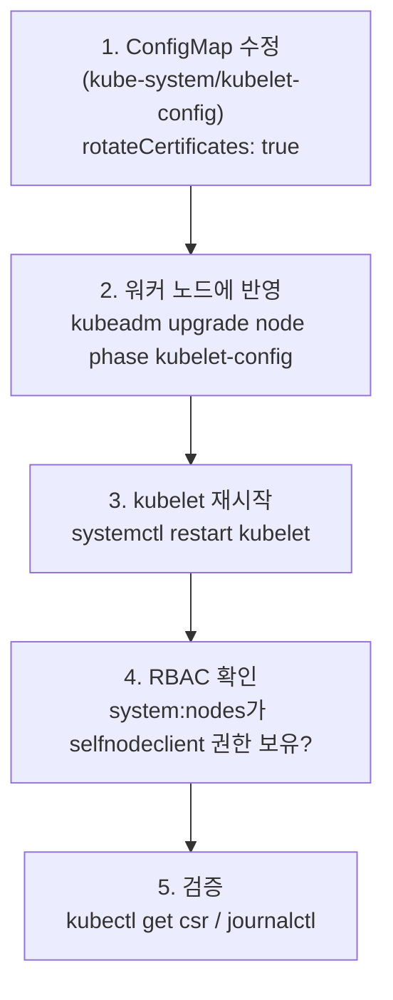

kubelet은 API 서버와 통신할 때 클라이언트 인증서로 자신을 증명합니다. 이 인증서는 기본 **1년 유효기간**을 가지는데, 노드가 수십~수백 대인 클러스터에서 만료 전마다 수동으로 갱신하는 건 현실적이지 않습니다. `rotateCertificates`는 이 갱신을 클러스터 수준에서 자동화하는 설정입니다.

## 핵심 원리

`kube-system` 네임스페이스의 `kubelet-config` ConfigMap에 `rotateCertificates: true`를 설정하면, kubelet이 인증서 만료 전 스스로 **CSR(CertificateSigningRequest)**을 생성하고 승인·발급 과정을 거쳐 새 인증서로 교체합니다.


ConfigMap을 수정해도 워커 노드의 로컬 설정 파일(`/var/lib/kubelet/config.yaml`)은 **자동으로 동기화되지 않습니다.** 반드시 각 노드에서 설정을 반영하고 kubelet을 재시작해야 실제로 적용됩니다. 또한 `kubeadm upgrade` 시 로컬 설정이 ConfigMap 값으로 덮어씌워질 수 있으므로, 설정의 단일 진실 공급원(Single Source of Truth)은 항상 ConfigMap 쪽에 둡니다.


## 전체 흐름: "중앙에서 설정하고, 노드에서 적용한다"



이 5단계 중 가장 자주 빠뜨리는 것이 **2단계(노드 반영)**입니다. ConfigMap만 고쳐놓고 "설정했다"고 착각하는 경우가 가장 흔한 실패 패턴입니다.

## 단계별 적용 절차

### 1단계 — 컨트롤 플레인에서 설정 변경

```bash
# 현재 설정 확인
kubectl get configmap kubelet-config -n kube-system -o yaml | grep rotateCertificates

# patch로 직접 변경 (kubectl edit도 가능)
kubectl patch configmap kubelet-config -n kube-system --type merge \
  -p '{"data":{"kubelet":"apiVersion: kubelet.config.k8s.io/v1beta1\nkind: KubeletConfiguration\nrotateCertificates: true\n..."}}'
```


실제로는 ConfigMap의 `data.kubelet` 키 전체가 YAML 문자열 하나로 들어있어서, 위처럼 단순 patch보다는 `kubectl edit configmap kubelet-config -n kube-system`으로 직접 열어 `rotateCertificates: false`를 `true`로 바꾸는 것이 사고를 줄입니다.


### 2단계 — 워커 노드에 설정 반영

이 ConfigMap 수정만으로는 워커 노드에 아무 변화도 없습니다. 각 워커 노드에서 다음을 실행해야 합니다.

```bash
# 권장: kubeadm이 ConfigMap의 최신 값을 가져와 로컬 파일을 갱신
sudo kubeadm upgrade node phase kubelet-config

# 반영 확인
grep rotateCertificates /var/lib/kubelet/config.yaml
```

`kubeadm` 명령을 쓸 수 없는 환경이라면, ConfigMap의 `data.kubelet` 내용을 직접 추출해 `/var/lib/kubelet/config.yaml`에 수동으로 복사하는 방법도 있지만, 휴먼 에러 위험이 커서 가능하면 `kubeadm` 경로를 권장합니다.

### 3단계 — kubelet 재시작

```bash
sudo systemctl daemon-reload
sudo systemctl restart kubelet

# 정상 기동 확인
sudo systemctl status kubelet
```

### 4단계 — RBAC 권한 확인

자동 갱신은 노드가 스스로 CSR을 만들고 승인받는 과정이므로, `system:nodes` 그룹에 다음 권한이 있어야 합니다.

```bash
# system:nodes 그룹에 selfnodeclient 갱신 권한이 있는지 확인
kubectl get clusterrolebinding -o json | \
  jq '.items[] | select(.subjects[]?.name=="system:nodes") | .roleRef.name'
```

`system:certificates.k8s.io:certificatesigningrequests:selfnodeclient` 권한이 보이지 않는다면, 다음과 같은 `ClusterRoleBinding`이 필요합니다 (대부분의 kubeadm 클러스터는 기본 포함되어 있지만, 커스텀 RBAC로 덮어쓴 환경에서는 누락될 수 있습니다).

```yaml
apiVersion: rbac.authorization.k8s.io/v1
kind: ClusterRoleBinding
metadata:
  name: kubelet-auto-rotate-certs
roleRef:
  apiGroup: rbac.authorization.k8s.io
  kind: ClusterRole
  name: system:certificates.k8s.io:certificatesigningrequests:selfnodeclient
subjects:
  - kind: Group
    name: system:nodes
    apiGroup: rbac.authorization.k8s.io
```

이 RBAC 권한 모델 자체에 대한 배경은 [보안 카테고리의 RBAC](../../security/concept/#rbac--최소-권한의-단위)에서 더 자세히 다룹니다.

### 5단계 — 정상 동작 검증

```bash
# 1) 로컬 설정이 true로 반영됐는가
grep rotateCertificates /var/lib/kubelet/config.yaml

# 2) 노드가 만든 CSR이 자동으로 승인·발급(Approved,Issued)됐는가
kubectl get csr | grep system:node

# 3) kubelet이 실제로 갱신을 시도/완료한 로그가 있는가
sudo journalctl -u kubelet | grep -i "certificate"
```

## 트러블슈팅: ConfigMap은 고쳤는데 인증서가 갱신되지 않는다

**현상**: `rotateCertificates: true`로 ConfigMap을 수정했는데, 몇 주가 지나도 노드의 인증서 만료일이 그대로다.

**의심되는 원인(가설)**: ConfigMap만 수정하고 워커 노드의 로컬 `kubelet config.yaml`은 동기화되지 않았을 가능성이 가장 높다. 또는 `kubeadm upgrade` 과정에서 로컬 설정이 옛 ConfigMap 값으로 덮어씌워졌을 가능성도 있다.

**확인할 명령어**:
```bash
# 1) 노드 로컬 설정에 실제로 반영되어 있는가 (ConfigMap이 아니라 노드 파일을 봐야 한다)
grep rotateCertificates /var/lib/kubelet/config.yaml

# 2) kubelet 프로세스가 그 설정으로 기동됐는가 (재시작 이후 시각 확인)
sudo systemctl status kubelet | grep Active

# 3) CSR이 생성은 됐는데 승인이 안 된 채 쌓여있는지 (RBAC 문제일 가능성)
kubectl get csr
```

**조치**: 로컬 파일에 `rotateCertificates: true`가 없다면 2단계(`kubeadm upgrade node phase kubelet-config`)가 빠진 것이다. CSR이 `Pending` 상태로 쌓여 있다면 RBAC 권한(4단계) 문제로 좁혀진다.

## 운영 체크리스트

- [ ] `kubelet-config` ConfigMap에 `rotateCertificates: true`가 설정되어 있는가
- [ ] **모든** 워커 노드의 `/var/lib/kubelet/config.yaml`에 동일한 값이 반영되어 있는가 (노드 하나만 빠뜨리는 사고가 흔하다)
- [ ] `system:nodes` 그룹에 `selfnodeclient` CSR 승인 권한이 있는가
- [ ] `kubectl get csr`로 주기적으로 `Pending` 상태 요청이 쌓이지 않는지 모니터링하는가
- [ ] `kubeadm upgrade` 이후 이 설정이 의도치 않게 되돌아가지 않았는지 업그레이드 후 재확인하는가
