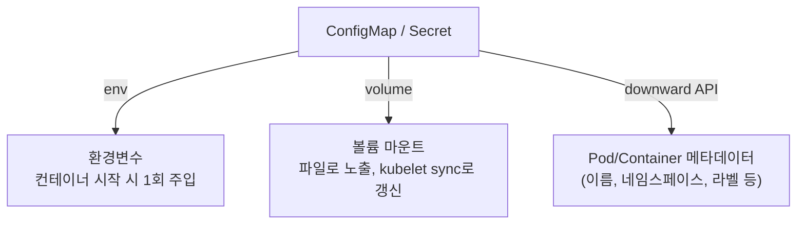

## 왜 알아야 하는가

이미지를 환경마다 다시 빌드하는 것은 "빌드한 것을 배포한다"는 원칙(build once, deploy anywhere)을 깨뜨립니다. 설정을 외부화하면 같은 이미지를 dev/staging/prod에 그대로 배포하고, 차이는 설정으로만 처리할 수 있습니다. 이 카테고리는 그 외부화 메커니즘 자체를 다룹니다 — 값이 "어떻게 안전하게 보관되는가"가 아니라 "어떻게 컨테이너에 도달하는가"가 초점입니다.

## ConfigMap과 Secret

둘 다 key-value 형태로 설정을 담는 오브젝트입니다. API 레벨에서의 차이는 크지 않습니다 — Secret의 값은 base64로 인코딩되어 저장된다는 점, 그리고 (보안 카테고리에서 다룰) RBAC·암호화 측면에서 더 엄격하게 다뤄진다는 점이 다릅니다.

- **ConfigMap**: 민감하지 않은 설정(로그 레벨, feature flag, 애플리케이션 설정 파일 등)
- **Secret**: 민감한 값(API 키, DB 비밀번호, TLS 인증서) — 단, 기본 Secret은 *암호화되지 않고 단지 인코딩*되어 있을 뿐입니다. "Secret을 쓴다"는 것 자체가 보안을 보장하지 않는다는 점이 실무에서 자주 오해되는 부분입니다.

## 주입 방식 3가지

| 방식 | 특징 | 변경 반영 |
| --- | --- | --- |
| 환경변수 (`env` / `envFrom`) | 가장 단순, 12-factor 스타일 | Pod 재시작 필요 (반영 안 됨) |
| 볼륨 마운트 | 파일 형태, 설정 파일이 많을 때 적합 | kubelet이 주기적으로 동기화(보통 1분 이내), 단 `subPath` 사용 시 자동 갱신 안 됨 |
| Downward API | Pod 자체의 메타데이터(이름, 네임스페이스, 라벨/어노테이션, 리소스 요청량) | Pod 생성 시점 기준 |

> 환경변수로 주입한 설정은 컨테이너 프로세스가 떠 있는 동안 절대 바뀌지 않습니다. "ConfigMap을 수정했는데 애플리케이션이 반영을 안 한다"는 문의의 90%는 이 사실을 모르고 env 방식을 쓴 경우입니다.

## Kustomize vs Helm — 의사결정 기준

| 기준 | Kustomize | Helm |
| --- | --- | --- |
| 패러다임 | 순수 YAML에 패치(overlay)를 쌓는다 | 템플릿 엔진 + 패키지(Chart) |
| 템플릿 로직 | 없음 (선언적 패치만) | Go template, 조건문/루프 가능 |
| 배포 단위 | 디렉터리 구조 자체가 곧 환경 | 버전 관리되는 Chart, 릴리스 단위 |
| 적합한 상황 | "우리가 직접 운영하는 매니페스트의 환경별 차이"를 표현할 때 | "재사용 가능한 패키지를 외부에 배포/공유"할 때, 서드파티 소프트웨어 설치 |
| 학습/디버깅 비용 | 낮음 (`kubectl kustomize` 로 결과 바로 확인) | 중간 (템플릿 렌더링 디버깅 필요) |

실무 판단: 직접 작성하는 내부 애플리케이션의 dev/stg/prod 차이는 **Kustomize 오버레이**로 충분한 경우가 많고, Prometheus/cert-manager처럼 서드파티 소프트웨어를 설치하거나 우리 자신의 차트를 외부에 배포해야 한다면 **Helm**이 적합합니다. 둘은 배타적이지 않습니다 — Helm으로 설치한 리소스를 Kustomize로 후처리(`helm template | kustomize build -`)하는 조합도 흔합니다.

## 설정 드리프트

GitOps 맥락에서 "드리프트"란 Git에 선언된 상태와 클러스터의 실제 상태가 어긋나는 것을 말합니다. 가장 흔한 원인은:

- 누군가 `kubectl edit configmap`으로 직접 수정 (Git에는 반영 안 됨)
- Helm 릴리스가 실패해서 일부만 적용된 상태로 멈춤
- 같은 리소스를 두 개의 파이프라인(CI/CD와 사람)이 동시에 건드림

드리프트 관리는 "감지"와 "방지" 두 축으로 접근합니다. 감지는 ArgoCD의 `OutOfSync` 상태 같은 지속적인 diff 비교로, 방지는 직접 `kubectl edit/apply`를 막는 RBAC·admission 정책으로 합니다. (GitOps 도구 자체는 [전달 & GitOps](../delivery-gitops) 카테고리에서 다룹니다.)
