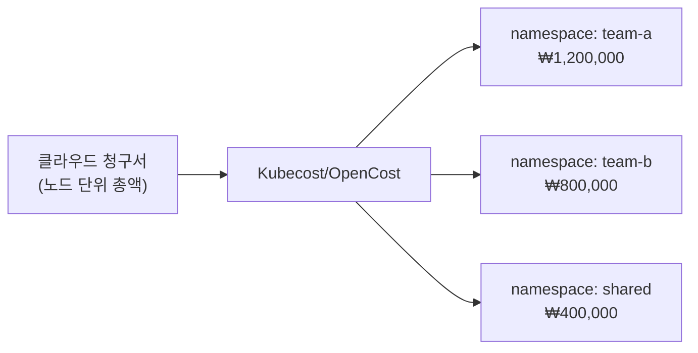
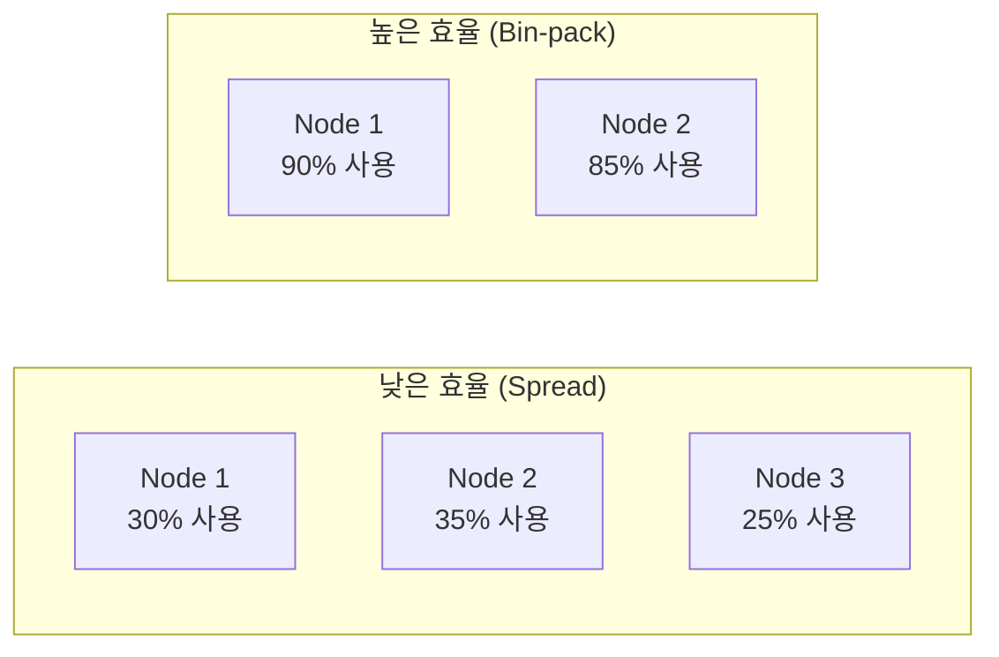

## 왜 알아야 하는가

대부분의 클러스터는 실제 사용량보다 훨씬 큰 requests를 잡아두고 운영된다. "장애가 나면 안 되니 넉넉하게"라는 방어적 습관이 누적되면 노드 사용률이 20~30%대로 떨어지고, 그만큼 돈을 그냥 태우는 셈이 된다. 비용 최적화는 신뢰성을 깎지 않으면서 이 여유분을 정량적으로 줄이는 작업이다.

## FinOps와 비용 가시성

Kubernetes 비용의 가장 큰 함정은 **클라우드 청구서에는 "EC2 비용 ₩X"만 찍히고, 그게 어느 팀/서비스 때문인지는 보이지 않는다**는 것이다. 네임스페이스/라벨 단위로 비용을 쪼개 보여주는 도구(Kubecost, OpenCost)가 필요한 이유다.

FinOps 문화의 핵심은 "비용을 인프라팀만 보는 숫자"가 아니라 "각 팀이 자기 네임스페이스의 비용을 직접 보고 책임지는 숫자"로 만드는 것이다. 비용 대시보드를 팀별로 공유하는 것만으로도 불필요한 리소스 요청이 줄어드는 경우가 많다.

## 리소스 right-sizing

requests를 너무 크게 잡으면 노드 사용률이 떨어지고, 너무 작게 잡으면 OOMKilled나 CPU throttling이 발생한다. 올바른 값은 **실제 사용 메트릭의 분포**에서 나와야 하며, 추측으로 정하면 안 된다.

| 신호 | 의미 | 조치 |
| --- | --- | --- |
| requests 대비 실제 사용률이 지속적으로 낮음(예: 20% 미만) | over-provisioned | requests 하향 조정 |
| limits 근처에서 CPU throttling이 잦음 | under-provisioned (CPU) | limits 상향 또는 limits 제거 검토 |
| OOMKilled가 반복됨 | under-provisioned (메모리) | memory requests/limits 상향 |
| QoS class가 Burstable인데 항상 limits까지 사용 | 실질적으로 Guaranteed가 필요한 워크로드 | requests=limits로 변경 검토 |

VPA(Vertical Pod Autoscaler)를 처음엔 `Off` 모드(추천값만 계산, 자동 적용 안 함)로 돌려 추천값을 관찰하고, 신뢰가 쌓이면 `Auto`로 전환하는 것이 안전하다.

## 스팟·노드 풀 전략

스팟(spot)/preemptible 인스턴스는 온디맨드 대비 60~90% 저렴하지만 언제든 회수될 수 있다. 모든 워크로드를 스팟에 올리면 안 되고, **중단을 견딜 수 있는 워크로드**만 선별해야 한다.

| 워크로드 특성 | 적합한 노드풀 |
| --- | --- |
| stateless, 여러 replica, 빠른 재시작 가능 (대부분의 웹 서버) | 스팟 |
| 배치/CI 작업 (체크포인트 가능) | 스팟 |
| 단일 replica 상태 유지, 빠른 재시작 불가 (일부 DB) | 온디맨드 |
| control plane 컴포넌트, 핵심 시스템 애드온 | 온디맨드 |

taint/toleration과 nodeAffinity를 조합해 "스팟에 가도 괜찮은 워크로드만 스팟 노드풀에 스케줄링"되도록 강제하는 것이 기본 패턴이다. 스팟 회수 시 Karpenter/Cluster Autoscaler가 자동으로 대체 노드를 프로비저닝하도록 구성한다.

## bin-packing 효율

여러 작은 노드에 워크로드가 듬성듬성 퍼져 있으면 각 노드는 적게 쓰이는데 노드 수는 많아진다. Kubernetes 기본 스케줄러는 "가장 여유 있는 노드에 배치"하는 경향(`LeastAllocated`)이 있어, 오히려 노드를 넓게 쓰게 만들고 사용률을 낮춘다.

Karpenter처럼 "필요한 만큼만 정확한 크기의 노드를 새로 띄우고, 빈 노드는 빠르게 회수(consolidation)"하는 오토스케일러를 쓰면 bin-packing 효율이 Cluster Autoscaler 대비 크게 개선되는 경우가 많다. 스케줄러 정책을 `MostAllocated` 기반으로 바꾸는 것도 한 방법이지만, 가용성(장애 도메인 분산)과 상충될 수 있어 신뢰성 요구사항과 함께 검토해야 한다.
