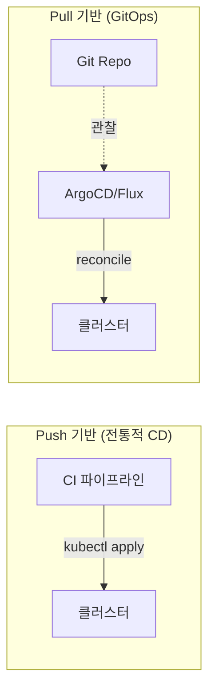

## 왜 알아야 하는가

`kubectl apply`를 사람이 직접 실행하는 방식은 "누가 언제 무엇을 바꿨는지" 추적이 안 되고, 클러스터의 실제 상태와 의도한 상태가 조용히 벌어지는 **드리프트**를 막을 방법이 없다. GitOps는 이 문제를 "Git 커밋 = 배포 승인 = 변경 이력"으로 묶어서 해결한다. 사고 조사 시 "지난주 화요일에 누가 무슨 이유로 replica를 줄였는가"를 Git 로그에서 바로 답할 수 있다는 것이 핵심 가치다.

## GitOps 원칙

1. **선언적 (Declarative)**: 시스템 전체가 선언적으로 표현된다.
2. **버전 관리 및 불변 (Versioned & Immutable)**: desired state는 Git에 저장되고 전체 이력이 남는다.
3. **자동으로 가져옴 (Pulled Automatically)**: 승인된 변경은 소프트웨어 에이전트가 자동으로 클러스터에 끌어온다.
4. **지속적으로 조정됨 (Continuously Reconciled)**: 에이전트가 실제 상태를 지속적으로 관찰하고 desired state와의 차이를 교정한다.

## Push 기반 CD vs Pull 기반 GitOps

| 항목 | Push (CI가 직접 배포) | Pull (GitOps 에이전트) |
| --- | --- | --- |
| 클러스터 자격증명 위치 | CI 시스템이 보유 (외부에 노출 위험) | 클러스터 내부 에이전트만 보유 |
| 드리프트 감지 | 없음 (다음 배포 전까지 모름) | 지속적으로 감지·자동 교정 |
| 변경 이력 | CI 로그에 흩어짐 | Git 커밋 하나로 일관됨 |
| 멀티클러스터 확장 | 클러스터마다 자격증명 배포 필요 | 클러스터가 스스로 pull (자격증명 분산 불필요) |

## ArgoCD vs Flux

| 항목 | ArgoCD | Flux |
| --- | --- | --- |
| UI | 강력한 웹 UI 기본 제공 | 기본 UI 없음 (CLI/CRD 중심, Weave GitOps 등 별도 UI 필요) |
| 아키텍처 | 중앙형 (Application CRD가 동기화 대상을 명시) | 컴포지션형 (Source/Kustomization/HelmRelease 등 여러 컨트롤러 조합) |
| 멀티클러스터 | ApplicationSet으로 클러스터 generator 지원 | Flux의 각 인스턴스가 클러스터별로 독립 운영되는 경향 |
| 적합한 경우 | 가시성(누가 무엇을 보는지)이 중요한 조직, 플랫폼팀이 UI로 상태를 보여줘야 할 때 | GitOps Toolkit을 다른 자동화(Flagger 등)와 깊게 엮고 싶을 때 |

## 프로모션 전략 (환경 승격)

같은 이미지 태그가 dev → staging → prod로 순서대로 승격되는 구조를 만드는 것이 핵심이다. 흔한 패턴 두 가지:

- **브랜치/디렉터리 분리**: `environments/dev`, `environments/staging`, `environments/prod` 디렉터리에 환경별 매니페스트(또는 Kustomize overlay)를 두고, PR로 디렉터리 간 변경을 승격한다.
- **이미지 태그만 갈아치우는 PR 자동화**: CI가 새 이미지를 빌드하면 dev 환경의 매니페스트 레포에 자동으로 PR을 올리고, 사람이 검토 후 머지하면 ArgoCD/Flux가 동기화한다. staging/prod로의 승격은 별도 PR(자동 또는 수동 승인)로 진행한다.


"같은 산출물(이미지)이 환경을 그대로 통과하는가"가 프로모션 전략의 핵심 검증 포인트다. 환경마다 다시 빌드하면 "테스트한 것"과 "배포되는 것"이 달라지는 사고로 이어진다.


## CI/CD와의 경계 구분

- **CI의 책임**: 코드 → 빌드 → 테스트 → 이미지 푸시 → (매니페스트 레포에 새 태그 반영 PR)
- **GitOps(CD)의 책임**: 매니페스트 레포의 상태를 클러스터에 동기화, 드리프트 교정, 헬스 체크 기반 자동 롤백

CI 파이프라인이 `kubectl apply`나 `helm upgrade`로 클러스터에 직접 접근하는 권한을 갖지 않도록 하는 것이 원칙이다. CI가 클러스터 자격증명을 가지는 순간, GitOps의 핵심 이점(자격증명 집중, 드리프트 감지)이 무너진다.
