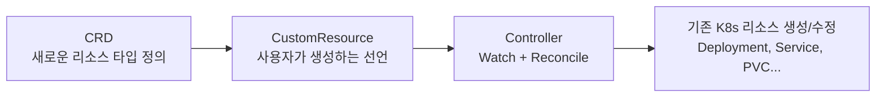

## 왜 알아야 하는가

"매번 같은 순서로 5개의 리소스를 만들고 연결해야 하는 작업"(예: 데이터베이스 클러스터 프로비저닝)을 사람이 `kubectl apply`로 반복하면 실수가 쌓입니다. CRD + 컨트롤러는 이 절차적 지식을 선언적 API로 캡슐화해서, 사용자는 "원하는 결과"만 선언하고 컨트롤러가 절차를 reconciliation으로 수행하게 만듭니다. 이게 Operator 패턴의 본질입니다.

## CRD와 컨트롤러의 관계



- **CRD**: API 스키마만 정의. 동작은 없음 — CRD만 등록하면 `kubectl get` 정도만 가능하고 아무 일도 안 일어남.
- **Controller**: CRD가 정의한 리소스를 watch하면서 "desired state(스펙) vs actual state(상태)"의 차이를 줄이는 루프를 무한 반복.
- **Operator**: 특정 도메인(예: PostgreSQL 클러스터)에 대한 운영 지식(백업, 장애조치, 버전 업그레이드)까지 캡슐화한 컨트롤러. "컨트롤러"가 더 일반적인 용어이고 "Operator"는 그중 도메인 운영 지식이 깊이 들어간 경우를 가리키는 관습적 표현입니다.

## Reconciliation Loop 설계 원칙

가장 중요한 원칙은 **idempotency(여러 번 실행해도 같은 결과)**와 **level-based(현재 상태 전체를 보고 판단, 이전 이벤트 기록에 의존하지 않음)**입니다.

```go
func Reconcile(ctx context.Context, req ctrl.Request) (ctrl.Result, error) {
    var obj MyResource
    if err := r.Get(ctx, req.NamespacedName, &obj); err != nil {
        return ctrl.Result{}, client.IgnoreNotFound(err)
    }
    // 현재 상태를 다시 읽고, desired와 비교해서 차이만 적용
    // "이전에 뭘 했는지"를 기억하지 않고 매번 현재 상태부터 판단한다
    return ctrl.Result{}, nil
}
```

**흔한 실수**: reconcile 함수 안에서 "이전 이벤트가 Add였는지 Update였는지"를 분기 처리하려는 시도. controller-runtime의 watch는 edge-triggered가 아니라 level-triggered로 설계해야 하며, 이벤트 종류와 무관하게 "지금 이 리소스가 어떤 상태인가"만 보고 판단해야 멱등성이 보장됩니다.

## Admission Webhook — Mutating vs Validating

| | Mutating | Validating |
| --- | --- | --- |
| 시점 | Validating보다 먼저 | Mutating 이후, 최종 검증 |
| 역할 | 요청을 자동으로 변형 (기본값 주입, sidecar 삽입) | 거부만 함, 변형하지 않음 |
| 예시 | Istio sidecar 자동 주입, 기본 리소스 limit 주입 | Kyverno/Gatekeeper 정책 위반 거부 |

CRD 컨트롤러를 만들 때 webhook을 추가하면 "이 CR이 생성되기 전에 스펙을 검증하거나 기본값을 채울 수 있다"는 추가 확장점이 생깁니다.

## Device Plugin / Scheduler Extension

GPU처럼 표준 리소스 모델(CPU/메모리)로 표현되지 않는 하드웨어는 **Device Plugin** API로 kubelet에 등록해서 `nvidia.com/gpu: 1` 같은 확장 리소스로 스케줄링 대상이 되게 만듭니다. 표준 스케줄러의 배치 로직 자체를 바꿔야 한다면(예: 특정 하드웨어 토폴로지 인식 배치) **Scheduler Extension**(scheduler plugin framework)을 사용합니다. 둘은 "리소스를 보이게 하는 것"과 "배치 알고리즘을 바꾸는 것"이라는 다른 레이어의 확장점입니다.

## 플랫폼 API로서의 추상화 설계

CRD를 설계할 때 가장 중요한 질문은 "이 스펙이 구현 세부사항을 노출하는가, 아니면 사용자의 의도를 표현하는가"입니다. 좋은 CRD는 `replicas: 3` 같은 의도를 받고, 그 의도를 어떤 StatefulSet/PVC 조합으로 구현할지는 컨트롤러 내부에 숨깁니다. 구현 세부사항(예: 사용할 StorageClass 이름)을 스펙에 그대로 노출하면, 나중에 내부 구현을 바꿀 때 모든 사용자의 매니페스트를 바꿔야 하는 결합이 생깁니다.
