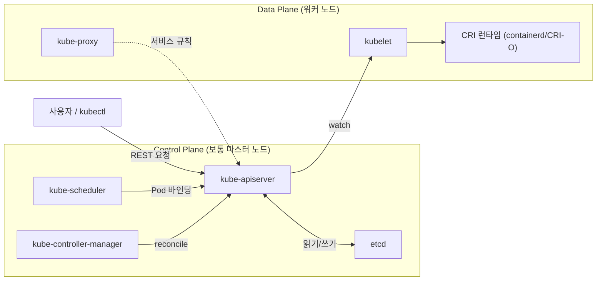
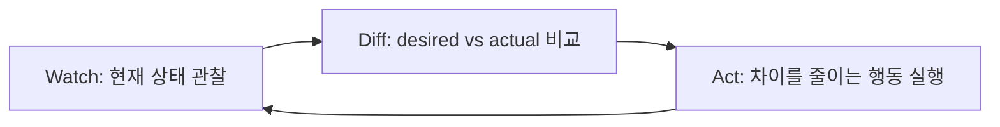

## 왜 이걸 먼저 알아야 하는가

쿠버네티스의 모든 리소스(Pod, Service, Deployment...)는 결국 "사용자가 선언한 상태(desired state)를 클러스터가 끊임없이 현재 상태(actual state)에 맞추려고 시도하는" 하나의 패턴 위에서 동작합니다. 이 패턴을 모르면 "왜 내가 지운 Pod가 다시 생기는지", "왜 적용한 YAML이 즉시 반영되지 않는지" 같은 질문에 답할 수 없습니다. 트러블슈팅의 90%는 "어떤 컨트롤러가 무엇을 reconcile하고 있는가"를 추적하는 일입니다.

## Control plane과 Data plane



| 컴포넌트 | 역할 | 한 줄 요약 |
| --- | --- | --- |
| kube-apiserver | 모든 요청의 단일 진입점, 인증/인가/검증 | "클러스터의 REST 게이트웨이" |
| etcd | 클러스터 상태 저장소 (key-value, Raft 합의) | "유일한 진실 원천(SSOT)" |
| kube-scheduler | 새 Pod를 어느 노드에 배치할지 결정 | "배치 알고리즘" |
| kube-controller-manager | 각종 컨트롤러(Deployment, Node, ...)의 reconcile loop 실행 | "선언 → 실행을 잇는 두뇌" |
| kubelet | 노드에서 Pod 스펙을 실제 컨테이너로 구현 | "노드의 에이전트" |
| kube-proxy | Service의 가상 IP를 실제 Pod로 라우팅하는 규칙 관리 | "노드의 라우터" |
| CRI 런타임 | 실제 컨테이너 생성/삭제 (containerd, CRI-O) | "컨테이너 실행기" |

## 선언적 모델과 reconciliation loop

명령형(imperative)은 "이렇게 해라"를 지시하지만, 쿠버네티스는 선언형(declarative)으로 "이런 상태이길 원한다"만 기술합니다. 모든 컨트롤러는 동일한 패턴을 반복합니다.



이 루프는 멈추지 않습니다. 예를 들어 `kubectl delete pod`로 Deployment가 관리하는 Pod를 지우면, ReplicaSet 컨트롤러가 "desired replicas=3인데 actual=2"라는 차이를 감지하고 즉시 새 Pod를 만듭니다. **"지웠는데 다시 생긴다"는 버그가 아니라 설계입니다.**

## API 객체 모델 — GVK

쿠버네티스의 모든 리소스는 `Group/Version/Kind`(GVK)로 식별됩니다.

- **Group**: `apps`, `batch`, `networking.k8s.io` 등 (core 그룹은 빈 문자열 `""`)
- **Version**: `v1`, `v1beta1` 등 — API 안정성 단계
- **Kind**: `Deployment`, `Pod`, `Service` 등 — 실제 리소스 타입

```bash
kubectl api-resources                     # 클러스터에 등록된 모든 GVK 목록
kubectl explain deployment.spec.strategy  # 특정 필드의 스키마 설명
```

CRD(Custom Resource Definition)를 설치하면 새로운 GVK가 클러스터 API에 추가됩니다. 이것이 [확장성 & 자동화]() 카테고리의 기반이 됩니다.

## etcd — 일관성 모델

etcd는 Raft 합의 알고리즘으로 복제되는 key-value 저장소입니다. 실무에서 알아야 할 것:

- **강한 일관성(linearizable read)**: API server가 etcd에서 읽는 데이터는 항상 최신 커밋된 값입니다 (단, `kubectl get --resource-version` 등으로 stale read를 허용할 수도 있음).
- **쿼럼 기반 쓰기**: 홀수 개(보통 3, 5)의 etcd 노드 중 과반수가 응답해야 쓰기가 성공합니다. 이 때문에 etcd 노드 수는 항상 홀수로 구성합니다.
- **단일 장애점이 되기 쉬움**: etcd가 느려지거나 디스크 I/O가 밀리면 API server 전체가 타임아웃됩니다. 클러스터 장애의 상당수가 etcd 디스크 latency 문제로 귀결됩니다.


desired state는 etcd에, actual state는 각 노드의 kubelet/컨테이너 런타임이 보고하는 status 필드에 있습니다. "동기화가 안 된다"는 문제는 항상 이 둘 중 어느 쪽이 stale한지를 먼저 구분해야 합니다.

