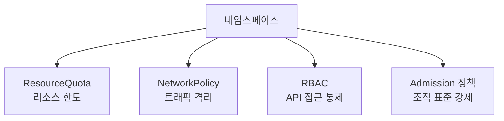

## 왜 알아야 하는가

"네임스페이스로 나눠놨으니 격리됐다"는 가장 흔한 착각이다. 네임스페이스는 기본적으로 **이름 충돌 방지를 위한 논리적 구획**일 뿐, 네트워크·리소스·노드를 자동으로 격리하지 않는다. 멀티테넌트 클러스터에서 사고가 나면 보통 "네임스페이스는 나눴지만 NetworkPolicy/ResourceQuota를 깜빡했다"가 원인이다.

## 네임스페이스 기반 테넌트 격리와 한계

네임스페이스가 기본 제공하는 것과 제공하지 않는 것을 구분해야 한다.

| 격리 영역 | 네임스페이스 단독으로 격리되는가 | 추가로 필요한 것 |
| --- | --- | --- |
| 리소스 이름 충돌 | 예 | - |
| 네트워크 트래픽 | 아니오 (기본은 전체 허용) | NetworkPolicy |
| CPU/메모리 사용량 | 아니오 | ResourceQuota, LimitRange |
| 노드 공유 (커널/cgroup) | 아니오 | 별도 노드풀 + taint, 또는 가상화 기반 격리(Kata Containers) |
| API 접근 권한 | 아니오 | RBAC RoleBinding (네임스페이스 스코프) |
| 정책 강제 (이미지 레지스트리 제한 등) | 아니오 | Admission 정책 (Kyverno/Gatekeeper) |



진짜 강한 격리(같은 노드의 커널을 공유하지 않는 격리)가 필요하다면 네임스페이스 수준이 아니라 **클러스터 분리** 또는 **가상화 기반 런타임**(Kata Containers, gVisor)까지 고려해야 한다. 대부분의 SaaS 멀티테넌시는 "네임스페이스 + 위 4가지 장치"로 충분하지만, 금융/의료 등 강한 컴플라이언스 요구가 있다면 클러스터 단위 분리가 기본값이어야 한다.

## 정책 거버넌스 (조직 표준의 코드화)

"이미지는 승인된 레지스트리에서만", "모든 Pod는 리소스 요청을 명시해야 한다" 같은 조직 규칙을 사람이 코드 리뷰로 강제하면 누락이 생긴다. Admission 정책 엔진으로 이를 자동화한다.

| 엔진 | 특징 |
| --- | --- |
| OPA Gatekeeper | Rego 언어로 정책 작성, ConstraintTemplate/Constraint CRD 분리 구조 |
| Kyverno | YAML 기반 정책 (Rego 학습 불필요), 정책 내에서 직접 mutate/generate 가능 |

대부분의 팀은 Rego의 러닝커브 때문에 최근에는 Kyverno를 더 선호하는 경향이 있다. 정책은 처음엔 `audit` 모드(거부하지 않고 위반만 기록)로 시작해서, 위반 사례를 충분히 파악한 뒤 `enforce`로 전환하는 것이 안전하다.

## 감사 로그 (audit)

Kubernetes API 서버는 누가 언제 무엇을 요청했는지 audit 정책에 따라 기록할 수 있다. 감사 로그가 없으면 "누가 이 Secret을 조회했는가", "누가 이 네임스페이스를 삭제했는가"를 사후에 답할 수 없다.

```yaml
# audit-policy.yaml 예시 - Secret 조회는 항상 기록
apiVersion: audit.k8s.io/v1
kind: Policy
rules:
  - level: Metadata
    resources:
      - group: ""
        resources: ["secrets"]
  - level: RequestResponse
    resources:
      - group: ""
        resources: ["pods"]
    verbs: ["delete"]
  - level: None
    users: ["system:kube-proxy"]
```

`level`은 `None < Metadata < Request < RequestResponse` 순으로 기록량이 늘어난다. Secret처럼 민감한 리소스는 최소 `Metadata` 레벨(누가 언제 접근했는지)은 반드시 남긴다.

## 규정 준수 프레임워크 매핑

PCI-DSS, HIPAA, SOC2 같은 외부 컴플라이언스 요구는 보통 "암호화", "접근 통제", "감사 추적", "변경 관리" 네 가지로 환원된다. 이를 클러스터 설정에 매핑하면:

| 컴플라이언스 요구 | 클러스터 설정 |
| --- | --- |
| 저장 데이터 암호화 | etcd encryption at rest, Secret을 KMS로 암호화 |
| 접근 통제 | RBAC 최소권한, 네임스페이스 격리 |
| 감사 추적 | Kubernetes audit log + 장기 보관 |
| 변경 관리 | GitOps (모든 변경이 Git 커밋으로 추적됨) |

CIS Kubernetes Benchmark 같은 표준화된 체크리스트를 `kube-bench`로 정기 스캔해 컴플라이언스 갭을 자동으로 점검하는 것이 실무에서 가장 빠르게 시작할 수 있는 방법이다.
