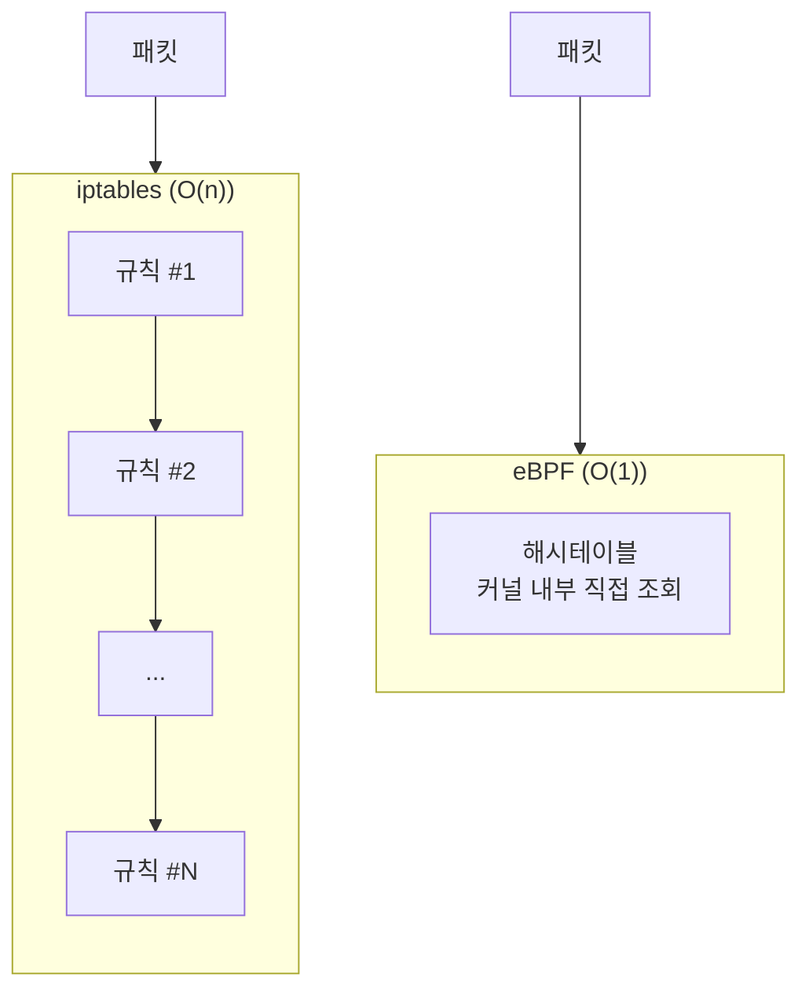

[Concept](../concept)에서 CNI는 "어떤 플러그인을 쓰느냐"의 표로 가볍게 다뤘습니다. 이 페이지는 그중 하나인 **Cilium**이 왜 사실상 표준(de facto standard)으로 자리 잡았는지, iptables 기반 CNI와 무엇이 다른지를 실무 관점에서 깊게 파고듭니다.

## 1. CNI의 세대교체 흐름

클러스터 규모가 커지면서 1세대 CNI의 한계가 명확해졌고, 그 한계를 푸는 과정에서 세대가 바뀌었습니다.

| 세대 | 대표 | 핵심 | 한계 |
| --- | --- | --- | --- |
| 1세대 | Flannel | VXLAN 기반, "연결만 되면 끝" | 네트워크 정책·보안 기능 자체가 없음 |
| 2세대 | Calico | BGP 라우팅 + L3/L4 NetworkPolicy | 커널 `iptables` 기반이라 서비스가 늘수록 성능 저하 |
| 3세대 | Cilium | eBPF로 커널에 직접 로직 주입 | (성능 병목을 구조적으로 해소) |


세대가 바뀐 이유는 "기능 추가"가 아니라 **이전 세대가 특정 규모에서 구조적으로 한계에 부딪혔기 때문**입니다. Flannel은 보안이 없어서, Calico는 iptables 탐색 방식 때문에 다음 세대가 필요해졌습니다.


## 2. 왜 iptables를 버리고 eBPF로 가야 하는가

실무에서 가장 체감되는 차이는 **확장성**과 **성능의 일관성**입니다.



- **순차 탐색(Linear Search, O(n))**: 패킷이 들어오면 규칙을 1번부터 차례로 탐색합니다. 서비스·정책이 수천 개로 늘어나면 탐색 시간이 길어져 트래픽 지연이 10~15% 이상 증가할 수 있습니다.
- **전체 재작성 부담**: 정책 하나만 바뀌어도 수만 줄짜리 iptables 테이블 전체를 다시 써야 합니다. 이 순간 트래픽이 잠깐 끊기는 사고로 이어질 수 있습니다.

```text
패킷 도착 → 규칙 1 확인 → 규칙 2 확인 → ... → 규칙 4,832 확인 → 매치!
(규칙이 늘어날수록 평균 탐색 시간도 늘어난다)
```


- **상수 시간 조회(O(1))**: 해시테이블로 패킷을 처리하므로 규칙이 10개든 10,000개든 동일한 속도로 처리됩니다.
- **커널 우회 및 효율화**: 유저 영역 ↔ 커널 영역 사이의 비싼 컨텍스트 스위칭을 피하고, 커널 내부에서 패킷을 직접 처리해 레이턴시와 처리량을 함께 개선합니다.

```text
패킷 도착 → 해시테이블 조회 → 매치!
(규칙이 10개든 10,000개든 조회 시간은 거의 동일하다)
```





규칙(서비스·NetworkPolicy)이 수백 개를 넘는 클러스터에서는 이 차이가 곧바로 체감되는 지연으로 나타납니다.

## 3. 실무자를 위한 Cilium의 3대 핵심 무기

Cilium은 패킷만 빠르게 보내는 CNI가 아니라 **네트워킹 + 보안 + 관찰성**을 하나로 묶은 플랫폼입니다.

### ① kube-proxy 완벽 대체

기존 Service 라우팅을 담당하던 `kube-proxy`를 완전히 제거할 수 있습니다. iptables 규칙 폭발이 원천적으로 사라지므로 대규모 클러스터에서도 네트워크 성능이 일정하게 유지됩니다.

```bash
# Helm으로 Cilium 설치 시 kube-proxy 완전 대체 설정
helm install cilium cilium/cilium \
  --namespace kube-system \
  --set kubeProxyReplacement=true \
  --set k8sServiceHost=<API_SERVER_IP> \
  --set k8sServicePort=6443
```

### ② 서비스 메시 없는 L7 보안 정책 (Identity 기반)

전통적인 방식은 시시각각 바뀌는 Pod IP를 추적하며 정책을 관리해야 해서 복잡했습니다. Cilium은 쿠버네티스 **레이블(Label)**을 기반으로 Identity를 부여해 정책을 제어합니다. Envoy 같은 무거운 사이드카 프록시 없이도 HTTP 메서드(GET/POST)나 URL Path 단위의 세밀한 L7 정책을 적용할 수 있습니다.

```yaml
apiVersion: cilium.io/v2
kind: CiliumNetworkPolicy
metadata:
  name: payment-api-l7
spec:
  endpointSelector:
    matchLabels:
      app: payment-api
  ingress:
    - fromEndpoints:
        - matchLabels:
            app: checkout-frontend
      toPorts:
        - ports:
            - port: "8080"
              protocol: TCP
          rules:
            http:
              - method: "GET"
                path: "/api/v1/orders/.*"
              - method: "POST"
                path: "/api/v1/payments"
```

`checkout-frontend` 라벨을 가진 Pod만 `/api/v1/orders/*`를 GET 하거나 `/api/v1/payments`를 POST 할 수 있고, 그 외 메서드/경로는 사이드카 없이 커널 레벨에서 차단됩니다.

### ③ 지옥 같던 네트워크 디버깅 탈출: Hubble

"패킷이 왜 막히지?"를 찾으려고 `tcpdump`를 뜨던 시절은 끝났습니다. Cilium의 내장 관찰성 도구 **Hubble**은 어떤 Pod 사이에서 트래픽이 오가는지, 어떤 정책 때문에 차단됐는지를 실시간 플로우와 서비스 맵으로 보여줍니다.

```bash
# 특정 네임스페이스의 실시간 트래픽 플로우 확인
hubble observe --namespace payment --protocol http

# 정책 때문에 거부된(DROPPED) 트래픽만 필터링 — "왜 막혔는지" 바로 확인
hubble observe --verdict DROPPED
```

```text
Jun 21 09:12:03.142  default/checkout-frontend-7d8f9 -> default/payment-api-x2k4j  FORWARDED  http: GET /api/v1/orders/882
Jun 21 09:12:05.601  default/legacy-batch-job-aa1b2   -> default/payment-api-x2k4j  DROPPED    policy denied (L7 method not allowed)
```

이렇게 차단 사유가 한 줄로 바로 보입니다. 이 데이터는 Prometheus·Grafana와도 쉽게 연동됩니다.

## 4. 실무 도입 체크리스트


**리눅스 커널 버전 확인 (가장 중요)**: eBPF를 네이티브로 쓰려면 커널 5.10 이상(RHEL 8.10 기준 4.18 이상)이 필요합니다. 구버전 OS에 설치하면 일부 기능이 **조용히** 꺼진 채로 동작합니다 — 에러 없이 기능만 비활성화되므로 도입 전 반드시 확인해야 합니다.


- [ ] **커널 버전**: 모든 워커 노드가 요구 커널 버전을 만족하는가 (`uname -r`로 확인)
- [ ] **노드 메모리 여유**: Cilium 에이전트는 엔드포인트·정책 수에 따라 노드당 150~250MB의 추가 메모리를 소모합니다. (다만 네트워크 효율이 좋아져 전체 노드 수를 10~15% 줄여 비용을 아낀 운영 사례도 있습니다)
- [ ] **클러스터 규모 대비 효과**: 서비스 500개 이하, 노드 200개 미만의 소규모 클러스터에서는 Flannel/Calico와 성능 차이가 크지 않습니다. 대규모 확장성·토폴로지 관찰성·L7 제어가 필요한 시점에 도입하는 것이 가성비가 좋습니다.
- [ ] **kube-proxy 대체 전환 계획**: 기존에 `kube-proxy`에 의존하는 애드온(일부 레거시 모니터링 등)이 있는지 점검 후 단계적으로 전환

## 핵심 요약

수천 개의 서비스가 움직이는 대규모 쿠버네티스 환경에서, 느려지는 iptables 규칙 탐색을 지우고 리눅스 커널 레벨(O(1))에서 네트워킹·보안·관찰성을 한 번에 해결하고 싶다면 Cilium이 정답입니다.
