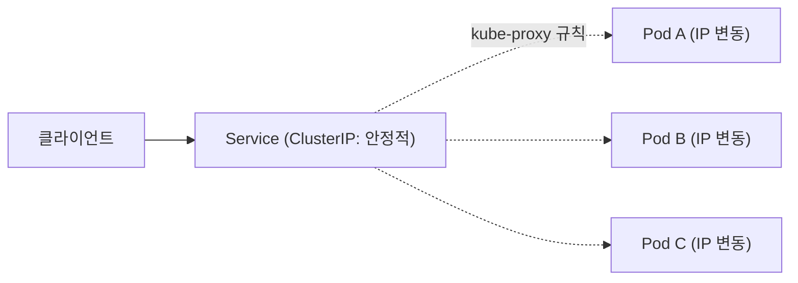

## CNI와 Pod 네트워크 모델

쿠버네티스 자체는 네트워킹을 구현하지 않습니다. "모든 Pod는 NAT 없이 서로 직접 통신할 수 있어야 한다"는 **요구사항**만 정의하고, 실제 구현은 CNI(Container Network Interface) 플러그인에 위임합니다.

| CNI 플러그인 | 방식 | 특징 |
| --- | --- | --- |
| Calico | BGP 라우팅 또는 VXLAN | 강력한 NetworkPolicy 지원, eBPF 데이터플레인 옵션 |
| Cilium | eBPF 기반 | 고성능, L7 정책, 서비스 메시 기능 내장 가능 |
| Flannel | VXLAN overlay | 단순함, 기본 기능 위주 |
| AWS VPC CNI | VPC 네이티브 IP 할당 | Pod가 VPC IP를 직접 받음, AWS 네트워크와 통합 |

CNI 선택은 "NetworkPolicy를 얼마나 세밀하게 쓸 것인가", "성능이 중요한가", "클라우드 네이티브 통합이 필요한가"로 결정됩니다.

## Service — 안정적인 진입점

Pod는 재시작될 때마다 IP가 바뀝니다. Service는 라벨 셀렉터로 묶인 Pod 집합에 **고정된 가상 IP(ClusterIP)** 를 부여해 이 문제를 해결합니다.

| Service 타입 | 용도 |
| --- | --- |
| **ClusterIP** (기본) | 클러스터 내부 통신 전용 |
| **NodePort** | 모든 노드의 특정 포트로 외부 노출 (테스트/온프레미스용) |
| **LoadBalancer** | 클라우드 LB를 프로비저닝해 외부 노출 |
| **ExternalName** | 클러스터 내부 이름을 외부 DNS로 CNAME 매핑 |
| **Headless (clusterIP: None)** | DNS가 개별 Pod IP를 직접 반환 — StatefulSet에서 사용 |

## kube-proxy 모드

Service의 가상 IP를 실제 Pod로 라우팅하는 규칙을 누가, 어떻게 적용하는가의 문제입니다.

| 모드 | 방식 | 특징 |
| --- | --- | --- |
| **iptables** (기본값, 구버전 기본) | Netfilter 규칙 체인 | 설정 단순하지만 Service 수가 많아지면 규칙 탐색이 선형적으로 느려짐 |
| **IPVS** | 커널의 IP Virtual Server | 해시 테이블 기반, 대규모 Service에서 iptables보다 빠름 |
| **eBPF** (Cilium 등) | 커널 eBPF 훅 | iptables 체인을 완전히 우회, 가장 빠르고 가장 최신 |

수백~수천 개의 Service를 운영한다면 iptables 모드는 규칙 적용 지연이 체감될 수 있습니다 — IPVS나 eBPF 기반 CNI로의 전환을 고려합니다. eBPF가 왜 구조적으로 더 빠른지, 도입 시 무엇을 체크해야 하는지는 [CNI 심화: Cilium과 eBPF](../cilium-ebpf)에서 더 깊게 다룹니다.

## DNS — CoreDNS

클러스터 내부 모든 Service는 `<service>.<namespace>.svc.cluster.local` 형태로 자동 등록됩니다. CoreDNS가 이 이름을 Service ClusterIP로 변환합니다. Pod의 `/etc/resolv.conf`에 CoreDNS가 기본 네임서버로, 그리고 `<namespace>.svc.cluster.local` 등이 search domain으로 들어가 있어 짧은 이름(`my-service`)만으로도 해석이 가능합니다.

## Ingress → Gateway API

Ingress는 "HTTP(S) 트래픽을 어떤 Service로 라우팅할지"를 정의하는 오래된 표준이지만, 다음과 같은 한계가 있습니다.

- 어노테이션에 컨트롤러별 커스텀 동작이 흩어져 있어 이식성이 낮음
- L4(TCP/UDP) 라우팅을 표준으로 표현할 수 없음
- 역할 분리(인프라 팀이 Gateway를 관리, 앱 팀이 라우팅 규칙만 관리)가 어려움

**Gateway API**는 이를 `GatewayClass`(구현체) / `Gateway`(진입점, 인프라 팀 소유) / `HTTPRoute`(라우팅 규칙, 앱 팀 소유)로 역할을 분리해 해결합니다. 신규 클러스터는 Ingress보다 Gateway API를 채택하는 추세입니다.

## 서비스 메시 — east-west 트래픽

Ingress/Gateway가 **north-south**(외부 → 클러스터) 트래픽을 다룬다면, 서비스 메시(Istio, Linkerd)는 **east-west**(Pod 간 내부) 트래픽을 다룹니다. 각 Pod에 사이드카 프록시(또는 ambient mode의 노드 단위 프록시)를 붙여 다음을 제공합니다.

- mTLS로 Pod 간 통신 자동 암호화
- 재시도, 서킷 브레이커, 타임아웃 같은 회복성 정책을 애플리케이션 코드 없이 적용
- 트래픽 분할(카나리 배포, A/B 테스트)
- 분산 트레이싱을 위한 자동 계측


서비스 메시는 강력하지만 사이드카만큼 latency와 운영 복잡도가 늘어납니다. "여러 서비스 간 mTLS/재시도/관측성을 일관되게 적용해야 하는가"가 명확한 도입 기준입니다 — 단일 모놀리식 서비스에는 불필요합니다.

