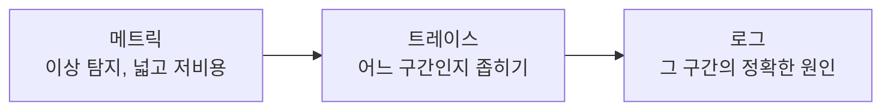

## 왜 알아야 하는가

장애가 터졌을 때 "로그를 봐야 하나, 메트릭을 봐야 하나"를 헤매는 팀은 대응 시간이 길어집니다. 세 신호는 깊이와 비용이 다른 트레이드오프 관계에 있고, 이걸 이해하면 장애 분석을 메트릭(넓고 싸게 이상 탐지) → 트레이스(좁히기) → 로그(정확한 원인)의 순서로 진행할 수 있습니다.

## 메트릭 — Prometheus 모델

Prometheus는 **pull 기반**입니다. 각 컴포넌트가 `/metrics` 엔드포인트를 노출하고 Prometheus가 주기적으로 스크랩합니다. 이 모델의 함의:

- 짧게 살다 죽는 Job/CronJob은 스크랩 시점에 이미 종료되어 메트릭이 안 잡힐 수 있다 → Pushgateway로 보완하거나 실행 시간을 늘려 노출 윈도우를 확보.
- `metrics-server`는 HPA 등 **리소스 메트릭**(CPU/메모리) 전용이며 장기 저장이나 PromQL 쿼리를 지원하지 않는다. Prometheus는 임의 메트릭 + 장기 저장 + 쿼리 언어를 제공하는 별개 시스템.

## 로깅 — 노드 단위 수집의 함의

쿠버네티스는 로그를 중앙화하지 않습니다. 컨테이너의 stdout/stderr는 노드의 컨테이너 런타임이 파일로 남기고, Fluent Bit 같은 DaemonSet이 노드마다 떠서 이를 수집해 Loki/Elasticsearch로 전송합니다. 이 구조 때문에:

- Pod가 삭제되면 노드에 남은 로그 파일도 보존 기간(보통 짧음) 후 사라진다 → 장애 분석 전 로그가 날아가지 않게 수집 파이프라인이 항상 동작해야 한다.
- Loki는 Elasticsearch와 달리 로그 본문을 풀텍스트 인덱싱하지 않고 **라벨로만 인덱싱**한다. 라벨 설계(namespace, pod, container)가 곧 쿼리 성능을 결정한다.

## 트레이싱

분산 트레이싱은 요청이 여러 서비스를 거칠 때 각 구간(span)의 소요 시간을 연결해서 보여줍니다. OpenTelemetry는 계측 표준(SDK + 프로토콜)이고, Jaeger는 저장·시각화 백엔드입니다. 마이크로서비스가 3개 이상으로 늘어나는 순간부터 "어디서 느려졌는가"는 로그만으로 답하기 어려워지고 트레이싱이 필수가 됩니다.

## Probe — liveness/readiness/startup의 차이

| Probe | 실패 시 동작 | 목적 |
| --- | --- | --- |
| startupProbe | 다른 probe를 지연시킴 | 느린 초기 부팅(JVM warm-up 등) 동안 liveness가 오작동하지 않게 보호 |
| livenessProbe | 컨테이너 재시작 | "이 프로세스가 멈췄다/데드락이다"를 감지 |
| readinessProbe | 서비스 엔드포인트에서 제외 (재시작 없음) | "지금은 트래픽을 받을 준비가 안 됐다" (의존 서비스 연결 대기 등) |

**흔한 실수**: readinessProbe가 필요한 자리에 livenessProbe만 설정하면, 의존 DB가 잠깐 끊긴 순간 컨테이너가 무한 재시작 루프에 빠집니다. "트래픽을 빼야 하는가 vs 프로세스를 죽여야 하는가"를 구분하는 것이 설계의 핵심입니다.

## SLI/SLO와 에러버짓

- **SLI**(Service Level Indicator): 측정 가능한 신호 (예: 성공 요청 비율, p99 레이턴시)
- **SLO**(Objective): SLI의 목표치 (예: 30일간 가용성 99.9%)
- **에러버짓**: 100% - SLO. "허용된 실패량"을 명시적으로 정의하면, 그 예산을 다 쓴 시점에 배포를 멈추는 식의 객관적 의사결정이 가능해집니다.

알림은 SLO를 위협하는 **번 레이트(burn rate)** 기준으로 설계하는 것이 단순 임계값 알림보다 노이즈가 적습니다 (예: "에러버짓을 1시간 안에 다 태울 속도로 에러가 나는가").
