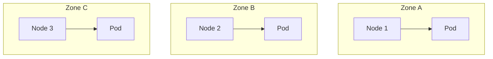

## 왜 알아야 하는가

레플리카를 3개로 띄웠다고 고가용성이 보장되는 게 아닙니다. 3개가 모두 같은 노드, 같은 가용 영역(zone)에 있다면 노드 하나가 죽을 때 전체가 동시에 죽을 수 있습니다. "복제 수"와 "장애 도메인 분산"은 별개의 설계 축입니다.

## 장애 도메인

`topologySpreadConstraints` 또는 `podAntiAffinity`로 동일 zone/node에 레플리카가 몰리지 않게 강제합니다. 이게 없으면 스케줄러는 "현재 여유 자원이 가장 많은 노드"를 기준으로만 배치하므로, 운 나쁘게 한 노드에 몰릴 수 있습니다.

## PodDisruptionBudget (PDB) — 자발적 vs 비자발적 중단

| 중단 유형 | 예시 | PDB가 막을 수 있는가 |
| --- | --- | --- |
| 자발적(voluntary) | 노드 드레인, 클러스터 업그레이드, `kubectl drain` | 가능 — PDB가 동시 중단 수를 제한 |
| 비자발적(involuntary) | 노드 하드웨어 장애, OOM kill | 불가능 — PDB는 예측 불가능한 장애를 막지 못함 |

PDB는 "운영자가 의도적으로 여러 Pod를 동시에 내릴 때, 최소 가용 수량을 지키게 강제"하는 도구입니다. `minAvailable: 2` (3개 중 최소 2개 유지) 같은 식으로 설정하면 클러스터 업그레이드 중에도 서비스가 완전히 끊기지 않습니다.

## 배포 전략 비교

| 전략 | 다운타임 | 롤백 속도 | 리소스 비용 | 적합한 상황 |
| --- | --- | --- | --- | --- |
| Rolling Update | 없음 (점진 교체) | 보통 | 낮음 (기존 + 일부 신규) | 대부분의 stateless 서비스 기본값 |
| Blue-Green | 없음 (스위치 순간) | 매우 빠름 (트래픽 전환만) | 높음 (신구 버전 풀스케일 동시 운영) | 빠른 롤백이 critical한 핵심 서비스 |
| Canary | 없음 (일부 트래픽만 신규로) | 빠름 (트래픽 비율만 조정) | 중간 | 실사용 트래픽으로 신버전을 점진 검증해야 할 때 |

**의사결정 기준**: "배포 실패를 사전에 100% 잡을 수 있는가"가 의심스러울수록 Canary로 실트래픽 검증 단계를 넣고, "전환 속도"가 최우선이면 Blue-Green을 씁니다.

## 카오스 엔지니어링

"이 시스템은 Pod 하나가 죽어도 버틴다"는 가정은 실제로 장애를 주입해보기 전까지는 검증되지 않은 믿음입니다. 카오스 엔지니어링은 운영 환경(또는 운영과 동일한 스테이징)에 의도적으로 Pod kill, 네트워크 지연, CPU 스트레스를 주입해서 그 가정을 실증적으로 검증하는 실천입니다. 핵심은 "예측 가능한 작은 blast radius"에서 시작해 점차 범위를 넓히는 것입니다.

## 용량 계획

오토스케일링(HPA/Cluster Autoscaler)이 있어도 "스케일업에 걸리는 시간"보다 트래픽 증가가 빠르면 무용지물입니다. 용량 계획은 과거 트래픽 패턴(피크 시즌, 마케팅 이벤트)을 기반으로 **사전에 baseline capacity를 늘려두는 것**과 오토스케일링을 결합하는 것입니다.
