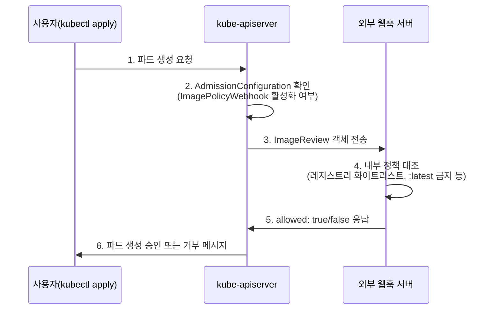

[Concept](../concept#정책-강제--opagatekeeper-vs-kyverno)에서 Kyverno와 OPA/Gatekeeper를 비교했습니다. 이 페이지는 그보다 더 근본적인 메커니즘인 **어드미션 컨트롤러(Admission Controller)** 자체가 어떻게 동작하는지, 그리고 쿠버네티스 초기부터 존재한 전통적인 이미지 검증 방식인 **`ImagePolicyWebhook`**과 그 설정 파일인 **`AdmissionConfiguration`**을 다룹니다.

## 왜 필요한가

`kubectl apply` 한 번이면 누구나 쉽게 워크로드를 배포할 수 있습니다. 그 편리함 뒤에는 위험이 숨어 있습니다 — 검증되지 않은 외부 이미지, 취약점이 포함된 `:latest` 태그 이미지가 그대로 배포될 수 있습니다. 어드미션 컨트롤러는 이런 요청을 **API 서버 안으로 들어오기 전에** 가로채 차단하는 문지기(Gatekeeper) 역할을 합니다.


이 구조의 핵심 가치는 "허가된 레지스트리에서만 이미지를 가져올 것", "명시적인 버전 태그만 사용할 것" 같은 정책을 **사람이 매번 확인하지 않고 자동으로 강제**한다는 점입니다. DevSecOps가 말로만 끝나지 않고 클러스터 레벨에서 시스템적으로 구현되는 지점입니다.


## 구성 요소

| 구성 요소 | 역할 |
| --- | --- |
| `kube-apiserver` | 모든 요청의 접점이자 문지기를 호출하는 주체 |
| Admission Controller | API 서버로 들어오는 요청을 검증·수정하는 플러그인. **Mutating**(요청을 변형, 예: 사이드카 주입)과 **Validating**(통과/거부 결정)으로 나뉜다 |
| `AdmissionConfiguration` | 어떤 컨트롤러를 어떤 순서·설정으로 운영할지 정의하는 설정 파일 — 문지기에게 주는 "지침서" |
| `ImagePolicyWebhook` | 컨테이너 이미지만 전문으로 심사하는 Validating 컨트롤러 — "이미지 전문 경찰관" |
| 외부 웹훅 서버 | 이미지 허용 여부를 실제로 판단하는 비즈니스 로직을 가진 서버 (직접 구현 필요) |

## 동작 흐름



웹훅 서버는 **무상태(stateless)**로 설계되는 것이 일반적입니다 — 매 요청마다 `ImageReview`를 받아 그 안의 이미지 정보만으로 판단하고 응답합니다.

## AdmissionConfiguration 파일 구조

```yaml
apiVersion: apiserver.config.k8s.io/v1
kind: AdmissionConfiguration
plugins:
  - name: ImagePolicyWebhook
    configuration:
      imagePolicy:
        kubeConfigFile: /etc/kubernetes/admission/imagepolicy-webhook-kubeconfig.yaml
        allowTTL: 50        # 허용(allow) 응답 캐시 시간(초)
        denyTTL: 50         # 거부(deny) 응답 캐시 시간(초)
        retryBackoff: 500   # 웹훅 호출 실패 시 재시도 간격(밀리초)
        defaultAllow: false # 웹훅 서버 통신 장애 시 기본 동작
```

| 항목 | 의미 |
| --- | --- |
| `plugins` | 활성화할 어드미션 컨트롤러 목록 |
| `configuration` | 각 컨트롤러의 상세 동작 설정 |
| `kubeConfigFile` | 외부 웹훅 서버 연결·인증 정보가 담긴 파일 경로 |
| `allowTTL` / `denyTTL` | 같은 이미지에 대한 웹훅 응답을 캐시해 API 서버 부하를 줄이는 시간 |
| `retryBackoff` | 웹훅 호출 실패 시 재시도 간격 |
| `defaultAllow` | 웹훅 서버 장애 시 요청을 통과시킬지(`true`) 막을지(`false`) |


`defaultAllow: true`는 웹훅 서버가 죽어도 배포가 막히지 않는다는 뜻입니다 — 가용성은 높아지지만, 그 순간 검증되지 않은 이미지가 그대로 통과할 수 있습니다. 보안이 우선이면 `false`로 두고 웹훅 서버 자체의 가용성(다중 replica, 헬스체크)을 높이는 쪽으로 풀어야 합니다.


## 적용 절차

1. **파일 작성**: 위 내용을 포함한 `AdmissionConfiguration` YAML을 작성합니다.
2. **API 서버에 전달**: `kube-apiserver` 실행 시 옵션을 추가합니다.
   ```bash
   kube-apiserver \
     --admission-control-config-file=/etc/kubernetes/admission/admission-config.yaml \
     ...
   ```
3. **재시작 및 확인**: API 서버가 재시작되며 이 설정을 읽고 `ImagePolicyWebhook`을 공식 문지기로 등록합니다.

### 웹훅 통신용 kubeconfig

`ImagePolicyWebhook`이 외부 서버와 통신할 때 API 서버 자신을 인증하는 설정입니다.

```yaml
apiVersion: v1
kind: Config
clusters:
  - cluster:
      certificate-authority: /etc/kubernetes/pki/webhook-ca.crt  # 웹훅 서버 인증서 CA
      server: https://my-webhook-server.svc:443/image-policy     # 웹훅 서버 엔드포인트
    name: image-policy-webhook
contexts:
  - context:
      cluster: image-policy-webhook
      user: api-server
    name: default
current-context: default
users:
  - name: api-server
    user:
      client-certificate: /etc/kubernetes/pki/apiserver-client.crt
      client-key: /etc/kubernetes/pki/apiserver-client.key
```

API 서버가 웹훅 서버에 요청을 보낼 때 본인이 누구인지 증명하고(클라이언트 인증서), 그 서버가 신뢰할 만한 곳인지 확인하는(CA 인증서) 절차입니다.

## ImagePolicyWebhook vs 현대적인 정책 엔진

`ImagePolicyWebhook`은 쿠버네티스 초기부터 있던 전통적인 방식입니다. 지금은 대부분 Kyverno/OPA Gatekeeper 같은 정책 엔진으로 옮겨갔습니다.

| | ImagePolicyWebhook (전통 방식) | Kyverno / OPA Gatekeeper (현대 방식) |
| --- | --- | --- |
| 유연성 | 직접 웹훅 서버를 개발·구현해야 함 | 정책(Policy) 파일만 작성하면 됨 |
| 운영 난이도 | 외부 웹훅 서버 운영·인증 관리 부담 | 쿠버네티스 내부 리소스(CRD)로 관리 |
| 기능 범위 | 이미지 정책에 특화 | Pod 보안, 네트워크 정책, 설정값 검증 등 광범위 |
| 상태 관리 | 무상태 웹훅 서버를 별도로 운영해야 함 | 클러스터와 정책이 함께 동기화됨 |

**실무 제언**: `ImagePolicyWebhook`의 구조를 이해하는 것은 어드미션 체인이 어떻게 동작하는지 파악하는 데 훌륭한 학습 자료입니다. 하지만 본격적인 운영 환경이라면 [Kyverno로 서명된 이미지만 허용하는 정책](../hands-on#3-kyverno로-정책-강제--서명된-이미지만-허용)처럼 YAML 정책 리소스만으로 같은 목적(그리고 그 이상)을 달성할 수 있는 현대적인 정책 엔진을 우선 검토하는 것이 유지보수 비용을 크게 줄입니다.

## 운영 체크리스트

- [ ] `defaultAllow` 값이 조직의 가용성/보안 우선순위에 맞게 의도적으로 설정되어 있는가
- [ ] 웹훅 서버가 단일 장애점(SPOF)이 되지 않도록 다중 replica로 운영되는가
- [ ] `allowTTL`/`denyTTL` 캐시 때문에 정책을 바꿔도 한동안 이전 판단이 적용될 수 있다는 점을 인지하고 있는가
- [ ] 신규 프로젝트라면 `ImagePolicyWebhook`을 새로 구축하기보다 Kyverno/Gatekeeper로 동일 요구사항을 해결할 수 있는지 먼저 검토했는가
