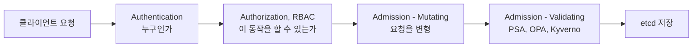

## 왜 알아야 하는가

쿠버네티스 보안 사고의 대다수는 "기능이 없어서"가 아니라 **기본값을 그대로 쓰거나, 여러 레이어 중 하나만 잠그고 나머지를 방치해서** 발생합니다. RBAC만 잘 설계하고 Pod가 `privileged: true`로 떠 있으면 RBAC는 의미가 없고, 반대로 PSA만 엄격하게 걸고 ServiceAccount에 cluster-admin을 붙여주면 PSA도 우회됩니다. 그래서 각 레이어가 정확히 "무엇을 막고 무엇을 안 막는지"를 아는 것이 핵심입니다.

## 요청이 거부되기까지의 체인

API 서버에 들어온 요청은 다음 순서로 검사됩니다. 이 순서를 모르면 "왜 이 정책이 안 먹히는지" 디버깅이 불가능합니다.

- **Authentication**: 클라이언트 인증서, ServiceAccount 토큰, OIDC 토큰으로 "누구"를 결정. 인증 실패 시 401.
- **Authorization (RBAC)**: 그 "누구"가 이 리소스에 이 동작(verb)을 할 권한이 있는지 확인. 거부 시 403.
- **Admission**: 권한이 있어도 정책 위반이면 거부(Validating) 또는 자동 수정(Mutating). 여기서 PSA, OPA/Gatekeeper, Kyverno가 동작.

## RBAC — 최소 권한의 단위

RBAC는 `Role`/`ClusterRole`(무엇을 할 수 있는가)과 `RoleBinding`/`ClusterRoleBinding`(누구에게)의 조합입니다.

| 조합 | 범위 | 용도 |
| --- | --- | --- |
| Role + RoleBinding | 네임스페이스 내 | 팀별/앱별 권한 분리 |
| ClusterRole + RoleBinding | 네임스페이스 내, 클러스터 전역 정의 재사용 | `view`, `edit` 같은 기본 ClusterRole을 특정 네임스페이스에만 적용 |
| ClusterRole + ClusterRoleBinding | 클러스터 전역 | 노드 조회, CRD 관리 등 네임스페이스 경계가 없는 리소스 |

**의사결정 기준**: "이 권한이 네임스페이스 경계를 넘는 리소스(Node, PV, CRD)를 다루는가?" 그렇다면 Cluster 단위가 불가피합니다. 그렇지 않다면 항상 네임스페이스 스코프 Role을 우선합니다.

## Pod 보안 — Pod Security Admission

PSA는 네임스페이스 라벨로 `privileged`/`baseline`/`restricted` 세 가지 레벨을 강제합니다.

| 레벨 | 허용 범위 | 사용 시점 |
| --- | --- | --- |
| privileged | 제약 없음 | CNI, CSI 드라이버 등 시스템 컴포넌트 |
| baseline | 알려진 권한 상승 차단 (hostNetwork, privileged 컨테이너 금지 등) | 일반 운영 워크로드의 최소 기준 |
| restricted | non-root 강제, capability 최소화, seccomp 필수 | 외부 입력을 처리하는 워크로드, 멀티테넌트 환경 |

기존 워크로드를 baseline에서 restricted로 실제로 올릴 때 무엇이 막히고 YAML을 어떻게 고쳐야 하는지는 [PSA 심화: Baseline → Restricted 전환](../psa-restricted-migration)에서 절차대로 다룹니다.

## 정책 강제 — OPA/Gatekeeper vs Kyverno

| | OPA/Gatekeeper | Kyverno |
| --- | --- | --- |
| 정책 언어 | Rego (범용, 학습 곡선 높음) | YAML (쿠버네티스 네이티브 문법) |
| Mutate 지원 | 가능하지만 번거로움 | 1급 기능 (patchStrategicMerge) |
| 적합한 상황 | 복잡한 조합 로직, 멀티 플랫폼 정책 재사용 | 쿠버네티스 전용, 빠른 온보딩 |

**의사결정 기준**: 정책 작성자가 쿠버네티스 YAML에만 익숙하다면 Kyverno, 이미 Rego로 다른 시스템(예: API 게이트웨이) 정책도 관리한다면 Gatekeeper로 통일하는 것이 유지보수 비용을 줄입니다.

## 공급망 보안

"이 이미지가 우리가 빌드한 그 이미지인가"를 보장하는 영역입니다. `cosign`으로 이미지에 서명하고, admission 정책(Kyverno `verifyImages` 등)으로 서명되지 않은 이미지의 배포를 거부합니다. SBOM(Software Bill of Materials)은 이미지 내부 패키지 목록이며, 취약점 스캐너가 CVE를 대조하는 기준 데이터가 됩니다.

## 런타임 탐지

정적 정책(어드미션)은 "배포 시점"만 검사합니다. 배포된 컨테이너가 런타임에 비정상 행위(예: 쉘 실행, 알려지지 않은 외부 연결)를 하는지는 Falco 같은 eBPF 기반 도구가 커널 이벤트를 실시간으로 관찰해서 탐지합니다. 정책과 탐지는 상호 보완 관계입니다.

## Secret 암호화

기본적으로 etcd에 저장되는 Secret은 **base64 인코딩일 뿐 암호화가 아닙니다.** etcd 디스크에 접근할 수 있으면 누구나 평문을 읽을 수 있습니다. 이를 막기 위한 선택지:

| 방식 | 동작 | 트레이드오프 |
| --- | --- | --- |
| KMS encryption-at-rest | etcd가 쓰기 전 외부 KMS로 암호화 | 클러스터 운영자가 설정, 키 관리 책임은 클라우드 KMS로 이전 |
| External Secrets Operator | 외부 Vault/SM에서 동기화해 K8s Secret 생성 | K8s Secret 자체는 여전히 평문 — etcd 암호화와 병행 필요 |
| Vault Agent Injector | Pod가 직접 Vault에서 동적 시크릿 획득, K8s Secret 자체를 안 만듦 | etcd 노출 위험 자체를 제거하지만 Vault 의존성 추가 |
| SOPS | Git에 커밋하는 시점에 암호화 (GitOps 친화적) | 클러스터 내부 보호가 아니라 "Git에 평문 노출 방지"가 목적 |

**의사결정 기준**: "Git에 평문이 올라가면 안 된다"는 SOPS, "etcd 디스크 탈취에도 안전해야 한다"는 KMS encryption-at-rest, "Secret의 TTL/회전까지 자동화해야 한다"는 Vault Agent Injector를 선택합니다. 셋은 배타적이지 않고 보통 함께 씁니다.
