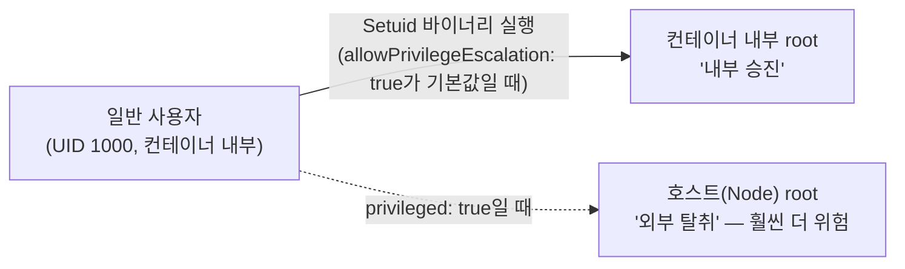

`privileged: true`(호스트 권한을 통째로 넘기는 설정)만 막으면 안전하다고 생각하기 쉽습니다. 하지만 `privileged: false`인 컨테이너 안에서도 **일반 사용자가 컨테이너 내부의 루트 권한을 가져가는 "내부 승진"**이 일어날 수 있습니다. 이 페이지는 그 메커니즘과, 이를 막는 `allowPrivilegeEscalation: false` 설정을 다룹니다.

## 왜 권한을 따로 주지 않아도 위험한가

리눅스에는 `passwd`, `sudo`처럼 실행하는 순간 잠시 루트 권한을 빌려오는 파일들이 있습니다. 이런 파일에는 **Setuid 비트**라는 특수 설정이 되어 있습니다.

컨테이너가 일반 사용자(예: UID 1000)로 떠 있더라도, 그 컨테이너의 파일시스템 안에 Setuid 바이너리가 포함되어 있다면 공격자는 그 바이너리를 실행해서 **컨테이너 내부의 루트(UID 0) 권한**을 얻을 수 있습니다. 호스트를 장악하는 것(`privileged: true`)과는 별개로, 컨테이너 안에서 "평사원이 사장이 되는" 승진이 가능한 것입니다.



## allowPrivilegeEscalation: false의 역할

이 설정을 `false`로 하면 리눅스 커널의 **`no_new_privs`** 플래그가 켜집니다. 이 플래그가 켜지면 어떤 파일(Setuid 바이너리 포함)을 실행하더라도 프로세스의 권한(UID/GID)을 바꾸는 행위 자체가 **커널 수준에서 차단**됩니다. 공격자가 Setuid 파일을 실행해도 권한 상승은 일어나지 않고, 컨테이너는 처음 지정된 사용자 권한에 그대로 고정됩니다.

## privileged vs allowPrivilegeEscalation

이름이 비슷해 보여도 막는 경계가 완전히 다릅니다.

| | `privileged: true` | `allowPrivilegeEscalation: true` (기본값) |
| --- | --- | --- |
| 비유 | 건물 전체를 여는 **마스터키** | 내부 승진을 막을 **보안 요원이 없는 상태** |
| 무엇이 뺏기는가 | 컨테이너 안의 일반 유저가 **호스트(Node)**의 루트 권한까지 가져감 (외부 탈취) | 컨테이너 안의 일반 유저가 **그 컨테이너 내부**의 루트 권한만 가져감 (내부 승진) |
| 무력화 대상 | seccomp, AppArmor 등 모든 보안 프로파일이 통째로 비활성화 | `no_new_privs` 커널 플래그 하나의 활성/비활성 여부 |
| 권장 설정 | CNI 플러그인, 스토리지 드라이버 등 특수 시스템 파드 외에는 지양 | 거의 모든 워크로드에서 `false`로 고정 |


`privileged: false`라고 안심하면 안 됩니다. `allowPrivilegeEscalation`을 명시적으로 `false`로 설정해야만 컨테이너 내부의 "내부 승진" 경로까지 함께 막힙니다. 이 둘은 서로 다른 경계를 막는 별개의 설정입니다.


## 표준 보안 설정 (Best Practice)

대부분의 애플리케이션은 호스트 권한이 필요 없습니다. 두 옵션을 모두 명시적으로 차단하는 것이 기본 원칙입니다.

```yaml
securityContext:
  privileged: false
  allowPrivilegeEscalation: false
  runAsNonRoot: true
  capabilities:
    drop: ["ALL"]
```

이 조합은 [PSA Restricted 레벨](../psa-restricted-migration)을 통과하기 위한 모범 답안과 정확히 같은 방향입니다 — Restricted는 이 두 설정을 사실상 강제합니다.

## 적용 절차

1. **현황 파악 (Audit)**: 현재 `privileged: true` 또는 `allowPrivilegeEscalation: true`인 파드가 있는지 클러스터 전체에서 확인합니다.
2. **테스트 (Dry-run)**: 바로 강제하지 말고 [PSA `warn` 모드](../psa-restricted-migration#warn-모드로-먼저-영향-범위-확인하기)로 위반 워크로드를 먼저 식별합니다.
3. **수정 및 배포**: 위반 파드의 `securityContext`를 표준 설정으로 고쳐 순차적으로 배포합니다.
4. **강제 적용 (Enforce)**: 수정이 끝난 뒤 네임스페이스를 `enforce`로 전환합니다.

## 탐지 방법

```bash
# privileged 모드로 떠 있는 파드 검색
kubectl get pods -A -o jsonpath='{range .items[*]}{.metadata.name}{"\t"}{.spec.containers[*].securityContext.privileged}{"\n"}{end}' | grep true

# allowPrivilegeEscalation이 true(또는 미설정 = 기본값 true)인 파드 검색
kubectl get pods -A -o jsonpath='{range .items[*]}{.metadata.name}{"\t"}{.spec.containers[*].securityContext.allowPrivilegeEscalation}{"\n"}{end}' | grep -v false
```

지속적으로 막으려면 일회성 점검보다 [Kyverno 같은 정책 엔진](../hands-on#3-kyverno로-정책-강제--서명된-이미지만-허용)으로 위반 파드의 생성 자체를 실시간 차단하는 것이 운영 부담을 줄입니다.

## 트러블슈팅

설정을 강화한 뒤 애플리케이션이 이상 동작하면 다음 세 가지 증상 중 하나일 가능성이 높습니다.



**원인**: 애플리케이션이 실행 중 루트 권한으로 파일을 수정하거나, 내부적으로 Setuid 바이너리를 실행하려 시도하고 있었는데 `allowPrivilegeEscalation: false`로 막힌 경우.

**해결**: 먼저 애플리케이션이 *왜* 루트 권한을 필요로 하는지 확인합니다. 불필요한 동작이면 코드/이미지에서 제거합니다. 정말 필요한 동작이라면 `privileged`를 켜는 대신, 필요한 권한만 `capabilities.add`로 최소 범위로 추가합니다.

```yaml
securityContext:
  allowPrivilegeEscalation: false
  capabilities:
    drop: ["ALL"]
    add: ["NET_BIND_SERVICE"]  # 예: 1024 미만 포트 바인딩만 필요한 경우
```


**원인**: CNI 플러그인, 모니터링 에이전트, 스토리지 드라이버처럼 하드웨어/커널을 직접 제어해야 하는 시스템 컴포넌트는 원래부터 `privileged: true`가 필요할 수 있습니다.

**해결**: 시스템 파드와 일반 애플리케이션 파드의 네임스페이스를 분리합니다. 시스템 파드는 별도 네임스페이스에서 PSA `privileged` 레벨로 예외 처리하고, 일반 앱 파드가 떠 있는 네임스페이스에만 `restricted`를 엄격히 적용합니다.


**원인**: `privileged: false`로 전환하면서 호스트 커널의 특정 시스템 콜 호출이 차단된 경우.

**해결**: `seccompProfile.type: RuntimeDefault`를 명시적으로 설정해 컨테이너 런타임의 기본 프로파일을 적용합니다. 표준적인 시스템 콜은 대부분 `RuntimeDefault`에서 허용됩니다.

```yaml
securityContext:
  seccompProfile:
    type: RuntimeDefault
```




보안 설정 강화는 기존 애플리케이션의 동작 방식을 일부 수정해야 할 수 있다는 전제를 깔고 일정을 잡는 것이 안전합니다 — "설정만 추가하면 끝"이 아니라 애플리케이션이 실제로 루트 권한에 의존하고 있었는지 검증하는 과정이 필요합니다.


## 운영 체크리스트

- [ ] 모든 컨테이너에 `allowPrivilegeEscalation: false`가 명시되어 있는가 (기본값은 `true`이므로 생략하면 위험)
- [ ] `privileged: true`인 파드가 CNI/CSI 같은 시스템 컴포넌트로만 제한되어 있는가
- [ ] 위 jsonpath 명령으로 정기적으로 위반 파드를 스캔하는가
- [ ] Kyverno/OPA로 신규 위반 파드의 생성 자체를 실시간 차단하고 있는가
- [ ] `capabilities.add`로 예외를 추가했다면, 정말 필요한 최소 capability인지 주기적으로 재검토하는가
