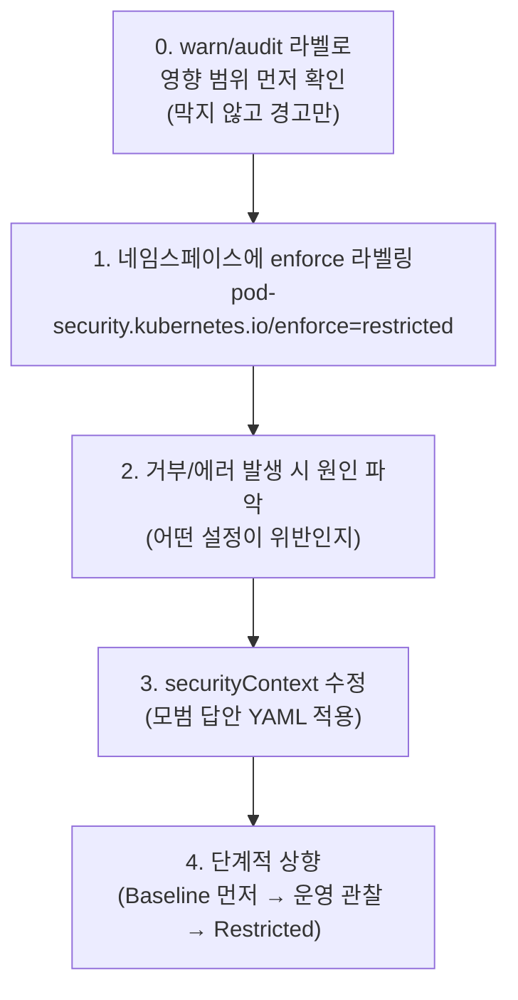

[Concept](../concept#pod-보안--pod-security-admission)에서 `privileged`/`baseline`/`restricted` 세 레벨을 표로 가볍게 다뤘습니다. 이 페이지는 실제로 네임스페이스를 `restricted`로 올릴 때 **무엇이 막히고, 어떤 YAML을 어떻게 고쳐야 하는지**를 절차 중심으로 다룹니다.

## 세 레벨이 실제로 막는 것

PSA의 핵심 개념은 단순합니다: Pod가 호스트 시스템이나 커널 자원에 접근하는 수준을 정책으로 정의해서, 그 수준을 넘는 설정이면 생성 자체를 거부하는 것입니다.

| 레벨 | 상태 | 용도 |
| --- | --- | --- |
| **Privileged** | 모든 보안 제한이 해제된 상태. 호스트 커널 접근, 루트 권한 사용 등이 가능한 사실상의 "무법지대" | CNI 플러그인, 스토리지 드라이버 등 시스템 운영에 필수인 파드에만 제한적으로 사용 |
| **Baseline** | 권한 상승을 유발하거나 호스트 노드에 직접 피해를 줄 수 있는 행위(`privileged` 모드, 호스트 네트워크/PID/IPC 공유 등)를 차단 | 대부분의 일반적인 컨테이너 애플리케이션에 권장되는 최소 표준 |
| **Restricted** | Baseline의 모든 제약을 포함하면서, 루트 사용자 실행 금지·권한 상승 금지·모든 Linux capability 차단 등 보안 베스트 프랙티스를 강제 | 인터넷에 노출되는 웹 애플리케이션처럼 보안이 중요한 서비스에 적극 권장 |


PSA는 "얼마나 자유롭게 시스템 자원을 쓸 수 있는가"를 조절해, 해킹이나 설정 오류로부터 클러스터를 보호하는 방어 체계입니다. 레벨이 올라갈수록 자유도는 줄고 안전성은 올라갑니다.


## 적용 절차

PSA는 **네임스페이스 단위**로 강제됩니다. 정책은 라벨로 설정하고, 정책을 위반하는 개별 파드는 YAML을 고쳐서 맞춥니다.



### 1단계 — 네임스페이스에 보안 레벨 적용

```bash
kubectl label namespace <네임스페이스명> pod-security.kubernetes.io/enforce=restricted
```


`enforce` 라벨은 **그 시점 이후 새로 생성되거나 수정되는 Pod**부터 검사합니다. 이미 떠 있는 Pod를 즉시 죽이지는 않습니다. 그래서 "라벨을 걸었는데 기존 서비스는 멀쩡하다"고 안심했다가, 다음 배포에서 한꺼번에 Pod 생성이 거부되는 사고가 흔합니다. 라벨을 걸기 전에 `audit`/`warn` 모드로 먼저 위반 여부를 확인하는 것이 안전합니다.


### Warn 모드로 먼저 영향 범위 확인하기

`warn`은 **막지 않고 알려주기만** 합니다. `enforce`로 바로 가기 전에 거의 항상 거쳐야 하는 단계입니다.


헷갈리기 쉬운 부분: `warn`/`enforce`/`audit`는 **네임스페이스에 붙이는 라벨**이고, Pod YAML에는 그 라벨이 요구하는 **준수 사항(securityContext)**을 적습니다. PSA가 "감사관"이고 Pod YAML은 그 감사관이 요구하는 "준수 서류"라고 보면 됩니다. `warn` 라벨을 한 번 붙여두면 그 뒤로 배포되는 모든 Pod가 자동으로 검사 대상이 되며, Pod YAML 쪽에 `warn`이라는 설정을 따로 적는 게 아닙니다.


```bash
# 1회만 실행 — 이 네임스페이스에 들어오는 모든 Pod를 경고 대상으로 지정
kubectl label namespace <네임스페이스명> \
  pod-security.kubernetes.io/warn=restricted \
  pod-security.kubernetes.io/audit=restricted
```

이 상태에서 `restricted`를 위반하는 Pod를 배포해 보면 어떤 일이 벌어지는지 직접 확인해 보겠습니다.

```yaml
# nginx-test.yaml — securityContext가 아예 없는 상태 (기본값은 보안 정책 위반)
apiVersion: v1
kind: Pod
metadata:
  name: nginx-test
spec:
  containers:
    - name: nginx
      image: nginx
```

```bash
kubectl apply -f nginx-test.yaml
```

```text
pod/nginx-test created
Warning: would violate PodSecurity "restricted:latest":
  - allowPrivilegeEscalation != false (container "nginx" must set securityContext.allowPrivilegeEscalation=false)
  - runAsNonRoot != true (pod or container "nginx" must set securityContext.runAsNonRoot=true)
  - seccompProfile (pod or container "nginx" must set securityContext.seccompProfile.type to "RuntimeDefault" or "Localhost")
  - capabilities (container "nginx" must set securityContext.capabilities.drop=["ALL"])
```

핵심은 **Pod가 막히지 않고 그대로 생성됐다는 점**입니다(`kubectl get pod`로 보면 `Running`). 동시에 경고 메시지가 "무엇을 고쳐야 하는지"를 거의 그대로 알려줍니다 — `allowPrivilegeEscalation`을 `false`로, `runAsNonRoot`를 `true`로, `seccompProfile.type`을 `RuntimeDefault`로, `capabilities.drop`을 `["ALL"]`로. 이 메시지를 그대로 YAML의 `securityContext`에 옮기면 됩니다.

배포 순간에 메시지를 놓쳤더라도 나중에 확인할 방법이 두 가지 있습니다.

```bash
# 1) 이미 생성된 Pod의 이벤트에 경고가 남아있다
kubectl describe pod nginx-test | grep -A5 Events
```

운영 환경이라면 같은 경고가 클러스터 **감사 로그(Audit Log)**에도 JSON 형태로 상세히 기록됩니다. 보안 담당자는 이 로그를 모아 "어떤 워크로드가 어떤 정책을 위반하고 있는지" 클러스터 전체 단위로 리스트업할 수 있습니다.

전체 흐름을 정리하면:

1. **환경 설정 (1회)**: 네임스페이스에 `warn` 라벨을 붙인다
2. **배포 (수시)**: Pod를 평소처럼 배포한다
3. **피드백 확인 (상시)**: 배포 시 터미널에 뜨는 `Warning: ...` 메시지, 또는 나중에 `kubectl describe pod`/감사 로그를 확인한다
4. **YAML 수정**: 경고 내용을 그대로 `securityContext`에 반영한다
5. **enforce 적용**: 경고가 더 이상 뜨지 않으면 라벨을 `enforce`로 바꿔 실제로 차단되게 만든다

### 2단계 — enforce 모드에서 에러 발생 시 원인 파악

`enforce`를 켠 뒤 Pod가 `Error`로 거부된다면, 보안 표준이 허용하지 않는 설정이 들어있기 때문입니다. `restricted`로 올릴 때 가장 자주 고쳐야 하는 항목은 다음과 같습니다.

| 체크 항목 | 수정해야 할 설정 (YAML) |
| --- | --- |
| 루트 권한 실행 | `runAsNonRoot: true`, `runAsUser`를 0이 아닌 값으로 설정 |
| 권한 상승 | `allowPrivilegeEscalation: false` |
| Linux capabilities | `capabilities.drop: ["ALL"]`로 초기화 |
| 볼륨 타입 | `hostPath` 제거 — `ConfigMap`/`Secret`/`emptyDir` 등으로 대체 |
| 시스템 콜 | `seccompProfile.type: RuntimeDefault` 적용 |

```bash
# Pod 생성이 거부될 때 사유를 바로 보여준다
kubectl apply -f pod.yaml
# Error from server (Forbidden): pods "app" is forbidden: violates PodSecurity "restricted:latest":
# allowPrivilegeEscalation != false, unrestricted capabilities, runAsNonRoot != true ...
```

이 에러 메시지 자체가 "무엇을 고쳐야 하는지"를 거의 그대로 알려주므로, 메시지를 그대로 체크리스트로 써도 됩니다.

### 3단계 — 모범 답안 YAML 적용

`restricted`를 통과하는 표준적인 `securityContext` 조합입니다.

```yaml
apiVersion: v1
kind: Pod
metadata:
  name: app
spec:
  securityContext:
    runAsNonRoot: true
    seccompProfile:
      type: RuntimeDefault
  containers:
    - name: app
      image: my-app:1.0
      securityContext:
        allowPrivilegeEscalation: false
        runAsUser: 1001
        capabilities:
          drop: ["ALL"]
        readOnlyRootFilesystem: true
```

Pod 레벨 `securityContext`(전체 Pod에 적용)와 컨테이너 레벨 `securityContext`(해당 컨테이너에만 적용)가 둘 다 필요합니다 — `runAsNonRoot`/`seccompProfile`은 Pod 레벨, `allowPrivilegeEscalation`/`capabilities`는 컨테이너 레벨에 주로 둡니다.

### 4단계 — 단계적 상향 전략 (권장)

처음부터 모든 네임스페이스를 `restricted`로 올리면 서비스 중단 위험이 큽니다. 다음 순서를 권장합니다.

1. **Baseline 적용**: 대부분의 일반적인 컨테이너는 큰 수정 없이 통과합니다. 먼저 전체에 적용해 기본 위생을 확보합니다.
2. **운영 경험 축적**: Baseline에서 워크로드가 어떻게 동작하는지 관찰 기간을 둡니다.
3. **Restricted로 전환**: 외부에 노출되는 웹 서비스, 멀티테넌트 네임스페이스처럼 보안이 중요한 대상부터 점진적으로 상향합니다.


Baseline은 대부분 수정 없이 통과하지만, Restricted는 `securityContext`를 **명시적으로** 작성해야 통과하는 경우가 많습니다. 기존 워크로드를 Restricted로 올릴 때는 위 3단계 YAML 추가가 거의 필수 작업이라고 가정하고 일정을 잡는 것이 안전합니다.


## 운영 체크리스트

- [ ] `enforce`를 걸기 전에 `audit`/`warn`으로 영향 범위를 먼저 파악했는가
- [ ] `warn` 단계에서 나온 경고 메시지가 더 이상 뜨지 않을 때까지 모든 워크로드의 YAML을 수정했는가 (감사 로그로 누락된 워크로드가 없는지 한 번 더 확인)
- [ ] `runAsNonRoot`, `allowPrivilegeEscalation: false`, `capabilities.drop: ["ALL"]`이 모든 컨테이너에 적용되어 있는가
- [ ] `hostPath` 볼륨을 쓰는 워크로드가 있다면 `ConfigMap`/`Secret`/PVC로 대체했는가
- [ ] `seccompProfile.type: RuntimeDefault`가 누락된 워크로드는 없는가
- [ ] CNI/CSI처럼 `privileged`가 정말 필요한 시스템 컴포넌트만 별도 네임스페이스로 분리해 예외를 최소화했는가
