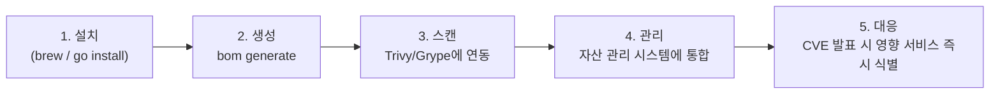

[Concept](../concept#공급망-보안)에서 SBOM을 "이미지 신뢰 여부를 판단하는 데이터" 정도로 짧게 언급했습니다. 이 페이지는 쿠버네티스 SIG-Release가 만든 **`bom`** 도구로 실제 SBOM을 생성하고, 그 결과물을 어디에 어떻게 활용하는지를 실무 절차로 다룹니다.

## SBOM이란

SBOM(Software Bill of Materials)은 소프트웨어를 구성하는 모든 오픈소스 라이브러리·프레임워크·모듈의 목록과 버전, 라이선스 정보를 담은 **소프트웨어 성분표**입니다. Log4j처럼 광범위한 오픈소스 취약점이 터졌을 때, "우리 서비스 중 어디가 영향을 받는가"를 즉시 파악하려면 이 성분표가 미리 만들어져 있어야 합니다.

## 왜 bom 도구인가

- **커뮤니티 검증**: 쿠버네티스 프로젝트 자체의 릴리스 보안을 위해 개발되어 신뢰도가 높습니다.
- **표준 포맷 지원**: 업계 표준인 **SPDX**와 **CycloneDX**를 모두 지원해 어떤 보안 스캐너와도 연동할 수 있습니다.
- **범용 분석**: 소스 코드(매니페스트 분석)부터 컨테이너 이미지(바이너리 분석)까지 같은 도구로 다룹니다.

## 전체 워크플로



### 1단계 — 설치 및 검증

```bash
# Homebrew
brew install bom

# 또는 Go 환경
go install sigs.k8s.io/bom/cmd/bom@latest

# 정상 설치 확인
bom version
```

### 2단계 — SBOM 생성

분석 대상이 소스 코드 디렉터리인지 컨테이너 이미지인지에 따라 명령이 다릅니다.



```bash
# 프로젝트 최상위 디렉터리에서 실행
bom generate -d .

# 표준 포맷으로 파일 저장 (권장)
bom generate -d . -f spdx-json > bom.spdx.json
bom generate -d . -f cyclonedx-json > bom.cdx.json
```

`go.mod`, `package.json`, `pom.xml` 같은 매니페스트 파일을 분석해 **간접 의존성(transitive dependencies)**까지 추출합니다.


```bash
# 이미지 내부의 패키지 구성을 분석
bom generate -i nginx:latest

# 표준 포맷으로 저장
bom generate -i nginx:latest -f cyclonedx-json > nginx-sbom.cdx.json
```

DevOps 환경에서 "이 이미지 안에 정확히 어떤 패키지와 버전이 들어있는가"를 확인할 때 사용합니다.




터미널 출력만 보고 끝내지 마세요. `-f` 옵션으로 표준 규격 파일(JSON)을 **반드시 저장**해야 다음 단계(스캔, 자산 관리 연동)에서 활용할 수 있습니다.


### 3단계 — 취약점 스캔

SBOM 파일 자체는 "성분표"일 뿐, 위험을 판단하는 건 보안 스캐너의 역할입니다.

```bash
# 생성된 SBOM을 Trivy에 입력값으로 전달
trivy sbom nginx-sbom.cdx.json
```

스캐너가 SBOM의 패키지 목록을 CVE 데이터베이스와 대조해 취약점 리포트를 만듭니다.

### 4단계 — 자산 관리 / 컴플라이언스

- SBOM에는 각 구성 요소의 **라이선스 정보**도 포함되므로, 조직 정책상 허용되지 않는 라이선스(예: 특정 GPL 변형)가 섞여 있는지 사전에 걸러낼 수 있습니다.
- 생성된 SBOM을 중앙 자산 관리 시스템에 모아두면, 클러스터에 배포된 수백 개 파드/이미지의 구성 요소를 대시보드로 한눈에 관리할 수 있습니다.

### 5단계 — 긴급 대응

Log4j급 취약점이 새로 공개되면, 이미 쌓아둔 SBOM 데이터베이스를 검색해 "어떤 서비스가 이 라이브러리를 쓰고 있는가"를 즉시 식별합니다. 이 한 단계가 SBOM을 미리 만들어 두는 이유의 거의 전부입니다 — 사고가 난 *후*에 전체 코드베이스를 grep하는 것과, 미리 만들어둔 성분표를 검색 한 번으로 끝내는 것의 차이입니다.

## CI/CD 파이프라인에 게이트로 통합

수동으로 만들게 하지 않는 것이 SBOM 도입의 핵심입니다. 빌드 단계에 한 줄 추가해서 자동화합니다.

```yaml
# GitHub Actions 예시 — SBOM 생성 후 취약점이 발견되면 빌드를 중단
- name: Generate SBOM
  run: bom generate -d . -f cyclonedx-json > bom.cdx.json

- name: Scan SBOM and fail on critical vulnerabilities
  run: trivy sbom --exit-code 1 --severity CRITICAL bom.cdx.json
```

이렇게 하면 "취약점이 있는 의존성을 포함한 코드는 애초에 배포 단계까지 못 간다"는 게이트가 생깁니다. [Kyverno로 서명된 이미지만 허용하는 정책](../hands-on#3-kyverno로-정책-강제--서명된-이미지만-허용)과 함께 쓰면, **이미지 출처(서명)**와 **이미지 내용(SBOM)**을 모두 검증하는 이중 방어선이 됩니다.

## 자주 묻는 질문

**Q. 실행 중인 Pod 목록을 실시간으로 보여주나요?**
아닙니다. `bom`은 소스 코드/이미지의 **정적 분석** 도구입니다. 실시간 워크로드 상태는 `kubectl`로 확인합니다 — 역할이 다릅니다.

**Q. 매니페스트 파일만 분석해도 충분한가요?**
네. `go.mod`/`package.json`/`pom.xml` 등을 분석하면 직접 의존성뿐 아니라 간접 의존성까지 추출됩니다.

## 운영 체크리스트

- [ ] SBOM 생성이 CI/CD 파이프라인에 자동화되어 있는가 (수동 생성에 의존하지 않는가)
- [ ] 조직 전체가 SPDX/CycloneDX 중 **하나의 포맷**으로 통일되어 있는가 (포맷이 섞이면 자산 관리 시스템 연동이 번거로워진다)
- [ ] 빌드 단계에서 CRITICAL 취약점 발견 시 파이프라인이 실제로 실패(Fail)하는가
- [ ] 소스 코드 SBOM과 컨테이너 이미지 SBOM을 모두 생성하는가 (둘은 다른 시점의 의존성을 잡아낸다)
- [ ] 라이선스 정책 위반 컴포넌트를 걸러내는 단계가 보안 스캔과 별도로 존재하는가
