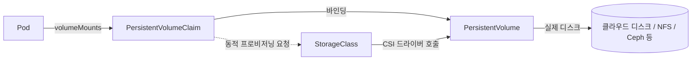

## 왜 알아야 하는가

쿠버네티스의 기본 단위인 Pod는 죽으면 그 안의 디스크도 함께 사라집니다. 그런데 데이터베이스, 캐시, 메시지 브로커 같은 워크로드는 Pod가 재시작되거나 다른 노드로 옮겨가도 데이터가 살아있어야 합니다. 이 간극을 메우는 것이 스토리지 서브시스템입니다. 실무에서 스토리지 설정을 잘못 이해하면 "Pod는 재시작됐는데 데이터가 날아갔다"는, 가장 늦게 발견되고 가장 비싼 장애를 만나게 됩니다.

## Volume, PV, PVC, StorageClass — 4단 구조

- **Volume**: Pod spec에 정의되는, Pod 생명주기에 종속되거나(emptyDir) 종속되지 않는(persistentVolumeClaim) 마운트 가능한 디렉터리 추상화.
- **PersistentVolume (PV)**: 클러스터 수준의 실제 스토리지 리소스. 관리자가 미리 만들거나(정적 프로비저닝), StorageClass를 통해 자동으로 생성됩니다(동적 프로비저닝).
- **PersistentVolumeClaim (PVC)**: 사용자(워크로드)가 "이만큼의 스토리지가 필요하다"고 선언하는 요청. PVC는 조건에 맞는 PV에 바인딩됩니다.
- **StorageClass**: "어떤 종류의 스토리지를 어떻게 프로비저닝할지"에 대한 템플릿. `provisioner` 필드가 어떤 CSI 드라이버를 호출할지 결정합니다.

실무에서는 정적 프로비저닝을 쓸 일이 거의 없습니다. StorageClass를 통한 동적 프로비저닝이 기본값이라고 생각하면 됩니다.

## CSI 드라이버

CSI(Container Storage Interface)는 쿠버네티스가 특정 스토리지 벤더 구현에 묶이지 않도록 만든 표준 인터페이스입니다. AWS EBS, GCP PD, Azure Disk, Ceph RBD, Longhorn 등은 모두 자체 CSI 드라이버를 제공합니다.

- CSI 드라이버는 보통 컨트롤러 컴포넌트(볼륨 생성/삭제/스냅샷, Deployment로 배포)와 노드 컴포넌트(실제 마운트/언마운트, DaemonSet으로 배포)로 나뉩니다.
- 노드 컴포넌트가 죽어 있으면 해당 노드의 Pod는 볼륨을 마운트하지 못해 `ContainerCreating`에 멈춥니다 — 장애 시 가장 먼저 의심할 지점입니다.

## Access Mode

| Access Mode | 의미 | 대표 백엔드 |
| --- | --- | --- |
| `ReadWriteOnce` (RWO) | 단일 노드에서 읽기/쓰기 | EBS, GCP PD, Azure Disk |
| `ReadOnlyMany` (ROX) | 여러 노드에서 읽기만 | NFS 기반 |
| `ReadWriteMany` (RWX) | 여러 노드에서 읽기/쓰기 | NFS, EFS, CephFS |
| `ReadWriteOncePod` (RWOP) | 클러스터 전체에서 단 하나의 Pod만 RW | 최신 CSI 드라이버 |

> RWO 볼륨을 여러 Pod(여러 노드)가 동시에 마운트하려고 하면 스케줄링이 막힙니다. StatefulSet을 RWO로 잘못 설계해 멀티 Replica가 한 노드에 몰리는 경우가 실무에서 흔한 함정입니다.

## Reclaim Policy

PVC가 삭제됐을 때 PV(와 그 안의 데이터)를 어떻게 처리할지 결정합니다.

- **Delete** (동적 프로비저닝 기본값): PVC 삭제 시 PV와 백엔드 디스크까지 삭제. 비용 절감에는 좋지만 실수로 PVC를 지우면 데이터가 영구 손실됩니다.
- **Retain**: PVC가 삭제돼도 PV와 데이터는 남습니다. 단, PV는 `Released` 상태가 되어 수동으로 정리하거나 재바인딩해야 합니다.


프로덕션 데이터베이스용 StorageClass는 `reclaimPolicy: Retain`으로 설정하는 것을 권장합니다. 기본값(Delete)을 그대로 쓰면 `helm uninstall` 한 번에 데이터가 영구히 사라질 수 있습니다.


## StatefulSet과 스토리지의 결합

StatefulSet은 `volumeClaimTemplates`를 통해 **각 Pod 레플리카마다 별도의 PVC**를 생성합니다. `web-0`, `web-1`, `web-2`는 각각 `data-web-0`, `data-web-1`, `data-web-2`라는 고유한 PVC를 가지며, Pod가 재스케줄링되어도 동일한 PVC에 다시 연결됩니다(이름 기반의 고정 identity).

- Deployment는 Pod identity가 없기 때문에 PVC를 공유하거나 ReadWriteMany가 필요한 구조가 됩니다.
- StatefulSet은 Pod identity가 있기 때문에 RWO로도 안전하게 "이 Pod는 항상 이 디스크"를 보장합니다.

이것이 "왜 DB는 StatefulSet으로 배포하라고 하는가"에 대한 근본적인 이유입니다.

## 백업·복구와 DR

PV/PVC 자체는 백업이 아닙니다. 클러스터가 통째로 사라지거나 사람이 실수로 네임스페이스를 지우면, PV의 reclaim policy와 관계없이 쿠버네티스 오브젝트 정의 자체가 사라집니다. **Velero**는 다음 두 가지를 함께 백업합니다.

1. 쿠버네티스 오브젝트(YAML 매니페스트 스냅샷, etcd 레벨이 아닌 API 레벨)
2. PV 데이터(CSI 스냅샷 또는 File System Backup/Restic 경로를 통해)

DR 전략을 세울 때는 "RPO(얼마나 많은 데이터 손실을 허용하는가)"와 "RTO(얼마나 빨리 복구해야 하는가)"를 먼저 정의하고, 그에 맞는 백업 주기와 복구 리허설 주기를 정하는 것이 순서입니다. 백업은 복구 테스트를 해본 적이 없다면 없는 것과 같습니다.
