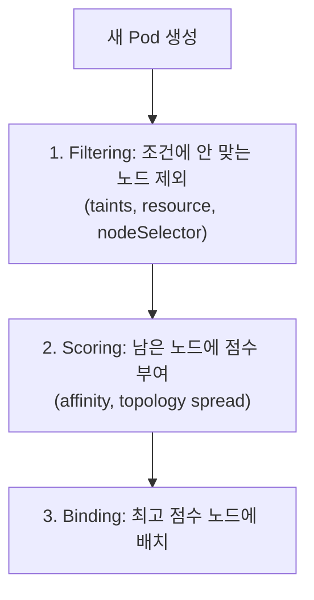

## 컨트롤러 선택 기준 — "이 워크로드는 상태가 있는가, 모든 노드에 필요한가, 끝이 있는가"

Pod를 직접 만드는 일은 거의 없습니다. 실무에서는 항상 상위 컨트롤러를 통해 Pod를 관리합니다.

| 컨트롤러 | 언제 쓰는가 | 핵심 특징 |
| --- | --- | --- |
| **Deployment** | 상태 없는(stateless) 서비스 — API 서버, 웹 프론트엔드 | 롤링 업데이트, 레플리카 수 보장, Pod 교체 시 새 이름/IP |
| **StatefulSet** | 상태 있는(stateful) 워크로드 — DB, 메시지 큐 | 고정된 네트워크 식별자(`pod-0`, `pod-1`), PVC가 Pod와 1:1로 유지, 순서 보장 배포 |
| **DaemonSet** | 모든(또는 특정) 노드에 정확히 1개씩 — 로그 수집기, CNI 플러그인, 모니터링 에이전트 | 노드 추가 시 자동 배치, 노드 단위 운영 |
| **Job** | 한 번 끝나면 되는 작업 — 배치 처리, 마이그레이션 | 완료 후 종료, 재시도 정책(backoffLimit) |
| **CronJob** | 주기적으로 실행되는 Job — 백업, 정기 리포트 | cron 표현식 스케줄, 동시성 정책(Allow/Forbid/Replace) |

**판단 트리**: 끝이 있는 작업인가? → Job/CronJob. 노드마다 1개씩 떠야 하는가? → DaemonSet. 디스크에 상태를 유지해야 하는가? → StatefulSet. 나머지는 대부분 Deployment.

## 스케줄링 제어

스케줄러는 기본적으로 "리소스가 충분한 노드 중 가장 적합한 곳"을 고르지만, 실무에서는 이 기본 동작을 세밀하게 제어해야 하는 경우가 많습니다.



| 메커니즘 | 역할 | 예시 |
| --- | --- | --- |
| **nodeSelector / nodeAffinity** | 특정 라벨을 가진 노드에만 배치 | GPU 노드에만 ML 워크로드 배치 |
| **podAffinity / podAntiAffinity** | 다른 Pod와 같이/떨어뜨려 배치 | 같은 앱의 Pod를 여러 가용영역(AZ)에 분산 |
| **taints / tolerations** | 노드가 특정 Pod만 받도록 "거부" 선언 | 마스터 노드에 일반 워크로드가 안 가도록 |
| **topologySpreadConstraints** | 토폴로지(zone, node)에 균등 분산 | 한 zone 장애가 전체 다운으로 이어지지 않게 |
| **priorityClass / preemption** | 중요도에 따라 낮은 우선순위 Pod를 쫓아내고 배치 | 긴급 워크로드가 자원 부족 시에도 뜨도록 |


`podAntiAffinity`를 `requiredDuringSchedulingIgnoredDuringExecution`으로 너무 엄격하게 걸면, 노드 수가 부족할 때 Pod가 영원히 Pending 상태에 머뭅니다. 실무에서는 `preferredDuringScheduling...`을 기본으로 쓰고, 정말 필수적인 경우에만 `required`를 씁니다.


## 리소스 모델 — requests/limits와 QoS

```yaml
resources:
  requests:
    cpu: "250m"     # 스케줄링 기준 (이만큼은 보장)
    memory: "256Mi"
  limits:
    cpu: "500m"      # 초과 시 throttling
    memory: "256Mi"  # 초과 시 OOMKilled
```

- **requests**: 스케줄러가 "이 노드에 배치 가능한가"를 판단하는 기준. 노드의 가용 리소스에서 차감됩니다.
- **limits**: 실제 사용 가능한 상한. CPU는 초과 시 throttling(느려짐), 메모리는 초과 시 컨테이너가 OOMKilled됩니다.

| QoS Class | 조건 | 특징 |
| --- | --- | --- |
| **Guaranteed** | 모든 컨테이너의 requests == limits | 노드 압박 시 가장 늦게 evict됨 |
| **Burstable** | requests < limits (일부라도) | 중간 우선순위로 evict |
| **BestEffort** | requests/limits 미설정 | 가장 먼저 evict됨 |

`LimitRange`(네임스페이스 기본값/상한 강제)와 `ResourceQuota`(네임스페이스 전체 사용량 제한)는 멀티테넌시 환경에서 "한 팀이 노드를 다 차지하는" 사고를 막는 안전장치입니다.

## 오토스케일링 — 무엇을 늘릴 것인가

| 도구 | 무엇을 스케일하는가 | 트리거 |
| --- | --- | --- |
| **HPA** (Horizontal Pod Autoscaler) | Pod 개수 | CPU/메모리 사용률, 커스텀 메트릭 |
| **VPA** (Vertical Pod Autoscaler) | Pod의 requests/limits 값 | 과거 사용 패턴 분석 (재시작 필요) |
| **Cluster Autoscaler** | 노드 개수 | Pending Pod 존재 + 스케줄 불가 |
| **Karpenter** | 노드 개수 + 타입 (빠르고 워크로드 맞춤형) | Pending Pod의 실제 요구사항에 맞는 인스턴스 즉시 프로비저닝 |

HPA와 VPA를 같은 메트릭(CPU)에 동시에 걸면 서로 충돌합니다(둘 다 "늘리기" 신호를 다르게 해석). 실무에서는 HPA(수평) 우선, VPA는 requests 초기값 추천용으로만 쓰는 경우가 많습니다.
